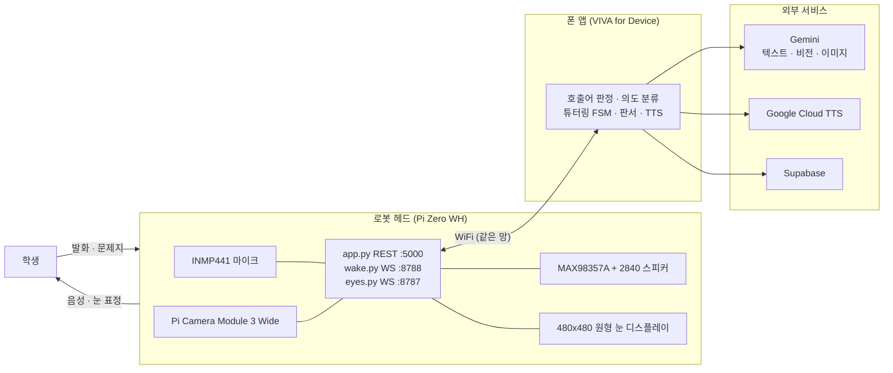
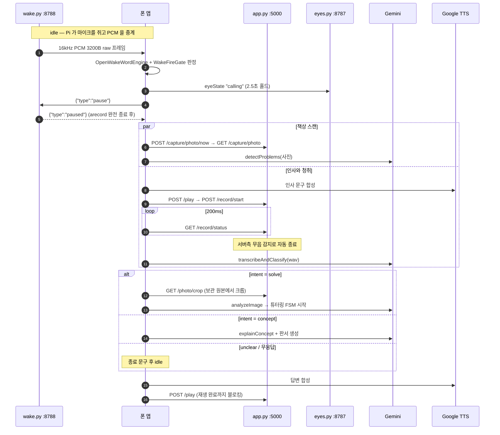
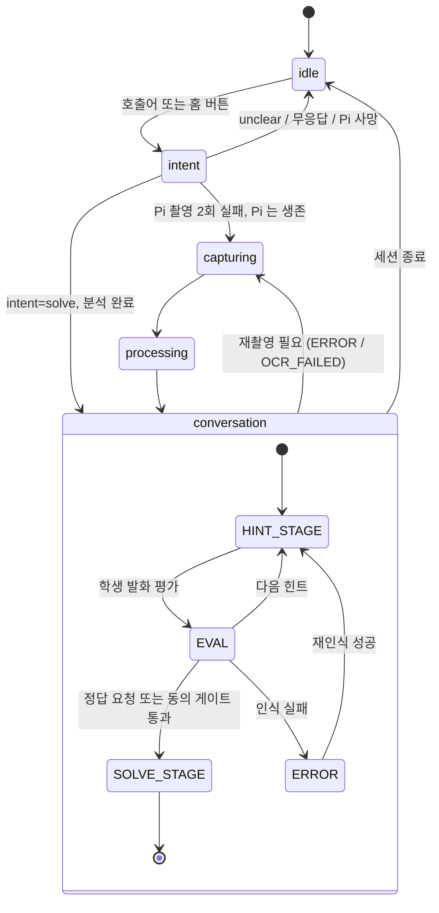

# VIVA — 하드웨어 결합 AI 수학 튜터 로봇

[](https://github.com/leeyunseokarchive/VIVA-Hardware-Enabled-AI-Tutor/actions/workflows/ci.yml)
[](LICENSE)
[](VivaMVP/viva-merged/package.json)
[](VivaHW/README.md)
[](VivaMVP/README.md)

> 이 저장소는 원래 비공개로 진행했던 2인 팀 프로젝트를 **포트폴리오 공개용으로 정리한
> 스냅샷**입니다. 사업기획/재무 문서, 레거시 아카이브, API 키가 담긴 내부 작업 로그 등
> 팀 내부용 자료는 제외했고, 하드웨어·소프트웨어 엔지니어링 문서와 소스 코드만 정리해
> 담았습니다. 원 저장소의 커밋 이력(31 commits)은 모두 제 단독 작업입니다.

중학교 수학을 소크라테스식으로 가르치는 AI 튜터 로봇입니다. 학생이 "비바야" 하고 부르면 로봇
헤드가 책상 위 문제를 촬영하고, 페어링된 폰 앱이 Gemini로 추론해 힌트를 판서와 음성으로
돌려줍니다. 정답을 먼저 주지 않고 **힌트 → 학생 답 평가 → 풀이 공개** 순으로 단계를 밟는 것이
제품의 핵심입니다.

- 소프트웨어(앱 구조·모듈·환경변수·테스트·빌드·Pi 엔드포인트): [VivaMVP/README.md](VivaMVP/README.md)
- 하드웨어(부품·출력·조립·결선·SD카드·전원): [VivaHW/README.md](VivaHW/README.md)
- 하드웨어 펌웨어 설치 절차: [VivaMVP/viva-merged/pi-server/README.md](VivaMVP/viva-merged/pi-server/README.md)

---

## 1. 시스템 구성



역할이 명확히 갈립니다. **헤드는 감각기관, 폰이 두뇌입니다.** Pi Zero는 싱글코어 ARMv6라 12MP
JPEG 인코딩만으로 코어를 다 씁니다. 호출어 ONNX 엔진도 Gemini 호출도 폰에 있고, Pi는 마이크
PCM을 중계하고 사진을 찍어 넘기고 폰이 합성해 보낸 mp3를 재생할 뿐입니다.

연결 판정의 주체는 하나입니다 — `connectionMonitor.service.ts`의 `GET /health` 5초 폴링. 눈
WS가 끊기거나 REST 호출이 실패해도 상태를 직접 바꾸지 않고 재프로브 트리거로만 씁니다.

---

## 2. 한 턴이 도는 순서



호출부터 첫 답변까지 실측 약 19.6초입니다(홈 버튼 기준. 촬영 13.1초 + 전송 0.4초 + 1차 분석
6.1초, 실기기 측정). 호출어와 홈 버튼은 같은 진입점(`beginCapture`)입니다. 인사 발화와 눈 표정
연출이 존재하는 이유가 이 시간을 덮기 위해서입니다. 단계별 계약과 실패 방식은
[VivaMVP/README.md](VivaMVP/README.md) §4에 있습니다.

---

## 3. 기술 스택

| 레이어 | 기술 | 버전 · 근거 |
|---|---|---|
| 앱 프레임워크 | React Native + Expo (CNG) | `0.74.5` / SDK `^51.0.39` — `viva-merged/package.json` |
| 언어 | TypeScript | `~5.3.3` — `viva-merged/package.json` |
| 호출어 | openWakeWord ONNX (`비바야`) | `onnxruntime-react-native` 1.18.0 고정 — `src/lib/openWakeWord.ts` |
| 추론 | Gemini 텍스트·비전 / 이미지 | `gemini-3.7-flash` / `gemini-3.1-flash-image` — `src/services/gemini.service.ts`, `src/services/board.service.ts` |
| 음성 합성 | Google Cloud TTS REST | `ko-KR-Chirp3-HD-Aoede` — `src/services/tts.service.ts` |
| 백엔드 | Supabase (Postgres + Storage) | `src/lib/supabase.ts` |
| Pi 서버 | Flask REST + websockets, picamera2, ALSA | `viva-merged/pi-server/app.py` |
| Pi OS | Raspberry Pi OS Lite **32-bit** (Bookworm) | ARMv6라 64-bit는 부팅하지 않음 |
| 하드웨어 | Blender + trimesh / manifold3d | `VivaHW/scripts/build_v24.py` |

---

## 4. 저장소 구조

```
VIVA-Hardware-Enabled-AI-Tutor/
├── README.md          이 문서
├── LICENSE
├── VivaHW/            로봇 헤드 하드웨어 — 기구 설계 · 3D 프린팅 · 조립 · 결선 · SD카드 · 전원
│   ├── README.md      하드웨어 단일 진실원
│   ├── docs/          부품 스펙 · 결선도
│   ├── models/        .blend 작업 원본과 출력용 .stl
│   └── scripts/       파라메트릭 빌드 스크립트와 전원 테스트
└── VivaMVP/           소프트웨어 — 폰 앱과 Pi 서버
    ├── README.md      소프트웨어 단일 진실원
    └── viva-merged/   앱 소스 루트 (src/ · pi-server/ · supabase/ · patches/ · tools/ · docs/)
```

`viva-merged/src/` 안에서 **`device/`와 `phone/`의 분리는 정리가 아니라 번들 경계입니다.**
폰 단독판을 빌드하면 `device/` 아래 모듈이 번들에서 통째로 빠집니다(§12 부록 A).

---

## 5. 빠른 시작 — 앱 설치부터 첫 대화까지

### 0. 준비물

| 항목 | 비고 |
|---|---|
| 안드로이드 또는 iOS 폰 1대 | 실기기 필요. 시뮬레이터는 로봇 연동 검증에 못 씀 |
| 조립된 로봇 헤드 | 없으면 [VivaHW/README.md](VivaHW/README.md)로 부품 구매부터 조립까지 |
| microSD 8GB 이상 | Raspberry Pi OS Lite 32-bit용 |
| 5V 전원 | 벤치 테스트는 micro-USB, 최종 형상은 선풍기 배터리 + XL3608 부스트 |
| macOS 개발 머신 | Xcode(iOS) 또는 Android Studio, Node.js |
| API 키 4종 | Gemini · Google Cloud TTS · Supabase URL · Supabase anon key (본인 발급 필요) |

폰과 로봇은 **같은 WiFi 망**에 있어야 합니다. 로봇과 폰은 로컬넷에서 직접 통신합니다.

### 1. API 키 발급과 `.env` 작성

```bash
cd VivaMVP/viva-merged
cp .env.example .env
```

키별 발급처와 어떤 값이 필수값인지는 [VivaMVP/viva-merged/.env.example](VivaMVP/viva-merged/.env.example)
주석에 적혀 있습니다. 필수는 `EXPO_PUBLIC_GEMINI_API_KEY` · `EXPO_PUBLIC_GOOGLE_TTS_API_KEY` ·
`EXPO_PUBLIC_SUPABASE_URL` · `EXPO_PUBLIC_SUPABASE_ANON_KEY` 네 개입니다. 모두 각자 발급받은
키로 채워야 하며, Supabase는 스키마도 별도로 필요합니다 — `supabase/migrations/`의 SQL을
파일명 순서대로 대시보드 SQL Editor에 붙여넣습니다.

**확인**: `npm install && npm test`가 통과합니다. 다만 이것이 증명하는 것은 **툴체인이 선다**는
것뿐입니다 — 테스트는 외부 API를 부르지 않으므로 `.env`가 비어 있어도 초록불이 뜹니다. 키가
실제로 유효한지는 5단계에서 첫 대화가 돌아야 처음 증명됩니다.

### 2. 폰에 앱 설치

```bash
npm install          # postinstall 이 patch-package 를 자동 실행
npm run ios          # 또는 npm run android
```

### 3. 하드웨어 펌웨어 세팅

SD카드를 굽고 Pi 소프트웨어를 올립니다. 절차 전체는 [VivaHW/README.md](VivaHW/README.md) §6과
[VivaMVP/viva-merged/pi-server/README.md](VivaMVP/viva-merged/pi-server/README.md)에 있습니다.

**확인**:

```bash
curl http://viva.local:5000/health
```

`{"status":"ok",...,"mic_ok":...,"speaker_ok":true}`가 오면 성공입니다.

### 4. WiFi 연동 & 5. 호출어로 첫 대화

앱 홈 화면의 WiFi 등록 화면에서 QR을 생성해 로봇 카메라에 보여주면 자동으로 연결됩니다.
연결되면 문제집을 로봇 앞 20~40cm에 펴고 "비바야"라고 부르면 대화가 시작됩니다. 자세한
증상별 해결법은 [VivaMVP/README.md](VivaMVP/README.md)에 정리되어 있습니다.

---

## 6. 핵심 모듈 지도

앱 로직은 `VivaMVP/viva-merged/src/`에 모여 있습니다.

| 파일 | 역할 |
|---|---|
| `src/hooks/useWakeWord.ts` | 호출어 "비바야" 온디바이스 감지(openWakeWord ONNX) |
| `src/device/services/piWakeStream.service.ts` | Pi 마이크 PCM WS 릴레이 구독, 촬영 전 `pause` ack 대기 |
| `src/device/hooks/useIntentLoop.ts` | Pi 상태 폴링 + 학생 의도 분류(촬영과 청취를 병렬로) |
| `src/hooks/useTutoringFSM.ts` | 힌트 / 평가 / 풀이 상태 전이, 재인식 사다리 |
| `src/services/gemini.service.ts` | 프롬프트 조립과 추론 요청 |
| `src/services/board.service.ts` | 판서 이미지 생성·오버레이 |
| `src/services/tts.service.ts` | 음성 합성과 재생 제어. `AudioSink`로 Pi 스피커에 위임 |
| `src/device/services/piBridge.service.ts` | Pi REST 클라이언트(엔드포인트 12개, 개별 타임아웃) |
| `src/device/services/connectionMonitor.service.ts` | `/health` 5초 폴링. **연결 상태의 유일한 판정자** |
| `src/hooks/useAppState.ts` | 화면 전이. 디바이스 셸이 여기에 눈 상태를 미러링 |

두 개의 상태 기계가 겹쳐 돕니다. `AppStatus`는 지금 어떤 화면인가이고, FSM state는 튜터링
대화가 어느 정책 단계인가입니다.



전체 파일 지도와 각 모듈의 설계 근거는 [VivaMVP/README.md](VivaMVP/README.md) §3 · §4 · §10에
있습니다.

---

## 7. 테스트

```bash
cd VivaMVP/viva-merged
npm test              # Jest
npx tsc --noEmit      # 타입 검사
npm run lint          # eslint (prettier 규칙 포함)
```

**53 suites / 557 tests 전부 통과**하는 상태를 유지합니다. 테스트는 별도 트리로 모으지 않고
대상 코드 바로 옆 `__tests__/`에 둡니다. GitHub Actions로 push/PR마다 자동 실행됩니다(상단
CI 배지 참고).

Pi 쪽 순수 함수는 하드웨어 없이 검사할 수 있습니다 — `python3 pi-server/test_imaging.py`,
`test_wake.py`, `test_audio_health.py`, `test_cam_health.py`, `test_record_trim.py`,
`test_splash.py`.

---

## 8. 빌드와 배포

`ios/`와 `android/`는 생성물입니다. 커밋하지 않고, 손으로 고치지 않습니다. `app.config.js`가
유일한 소스이고 `npm run ios` / `npm run android` 명령어를 실행하면 자동으로 생성·편집됩니다.
`patches/`의 patch-package 패치 3종은 `npm install`의 postinstall로 적용됩니다. 상세는
[VivaMVP/README.md](VivaMVP/README.md) §9.

---

## 9. VIVA for App — 로봇 없는 데모 버전 실행 방법

`VIVA for App`은 로봇이 없는 자리에서 앱 로직만 보기 위한 보조 빌드입니다.

```bash
cd VivaMVP/viva-merged
npm install && cp .env.example .env   # 값을 채운다
npm run ios:phone                     # 또는 npm run android:phone
```

device 판 대비 빠지는 것: 로봇 연동 일체(`src/device/`가 번들에서 통째로 제외), 카메라·마이크·
스피커가 폰 자체로 바뀜, 백그라운드 생존 없음. 분기의 전부는 `app.config.js` 첫 줄의
`process.env.APP_VARIANT === 'phone'` 하나입니다. 상세 대조표는
[VivaMVP/README.md](VivaMVP/README.md) §12.

---

## 라이선스

MIT — see [LICENSE](LICENSE).
