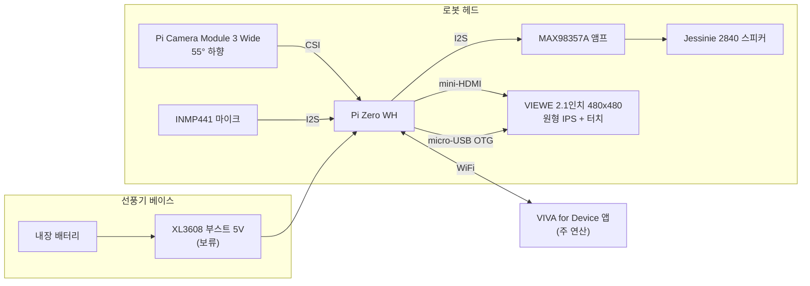
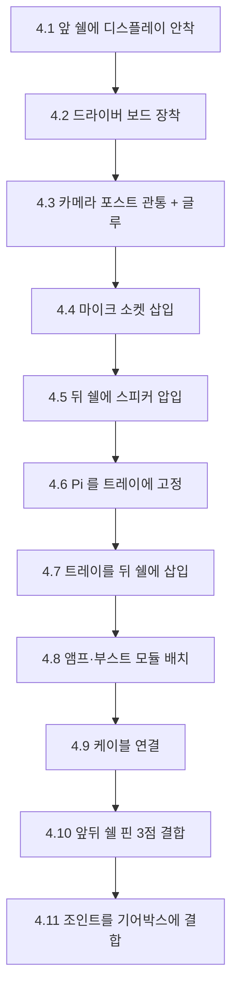
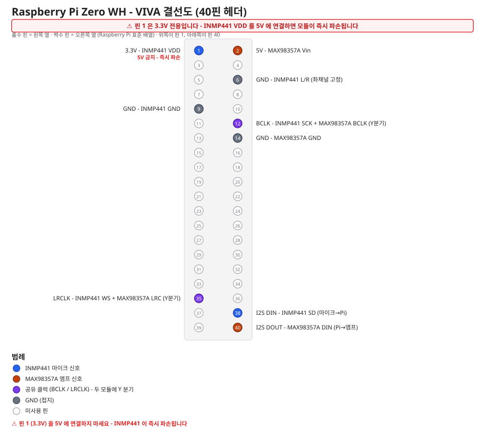
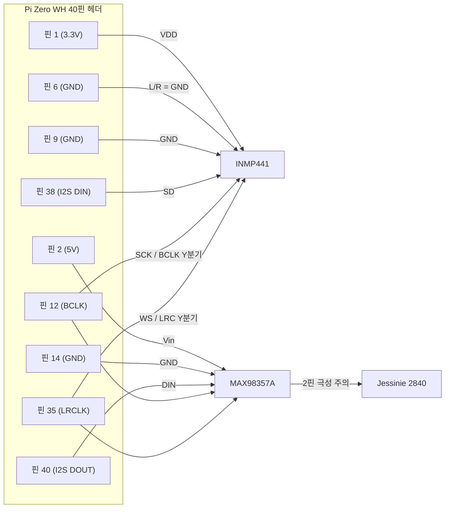
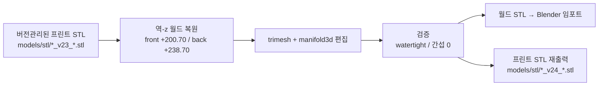

# VIVA 하드웨어 가이드 (VivaHW)

VIVA 로봇 헤드의 기구 설계, 3D 프린팅, 조립, 결선, Pi 세팅을 한 문서에 모았다.
이 폴더의 파일만 가지고 부품 구매부터 첫 부팅까지 끝낼 수 있도록 쓰였다.

모든 수치의 1차 출처는 [`docs/process.md`](docs/process.md) 다. 이 문서와 다른 값이
어딘가에 남아 있다면 `process.md` 가 맞다.

---

## 1. 개요

VIVA 는 루메나 선풍기 기어박스 위에 올라가는 로봇 헤드다. 제품은 **`VIVA for Device`
앱 + 로봇 헤드** 한 쌍으로 동작한다.

- **헤드가 하는 일**: 카메라·오디오 캡처와 디스플레이 출력만. 컴퓨트는 Pi Zero WH.
- **주 연산**: 페어링된 폰 앱이 담당. 헤드는 얇은 캡처/재생 단말이다.
- **헤드 형상**: 구 ⌀103.6mm, 벽 2.4mm. 전면은 평면으로 잘라낸 페이스이고 그 자리에
  원형 디스플레이가 베젤 없이 들어간다. 하단 조인트 디스크가 선풍기 기어박스와 결합한다.
- **분할**: 헤드는 z=38 (구 최대둘레 부근)에서 앞/뒤로 갈린다. 앞 38mm / 뒤 51.4mm.
  전자부품은 대부분 앞 쉘 쪽에 물리고, Pi 는 뒤 쉘에 들어가는 트레이에 올라간다.



---

## 2. 필요한 부품 (BOM)

단가는 확정된 항목만 적었다. `미확정` 은 이 저장소에 기록이 없다는 뜻이므로 구매
링크에서 직접 확인해야 한다.

### 2.1 전자부품

| 부품 | 규격 | 수량 | 대략 단가 | 구매 링크 | 비고 |
|---|---|---|---|---|---|
| 라즈베리파이 제로 WH | ARMv6 싱글코어, 40핀 헤더 실장품 | 1 | 미확정 | [디바이스마트](https://www.devicemart.co.kr/goods/view?no=1384052) | **헤더가 납땜된 WH 모델**이어야 한다. Zero 2W 품절로 대체된 구성 |
| RPi 전원선 Micro USB 5P Cable | micro-USB 5핀 | 1 | 미확정 | [디바이스마트](https://www.devicemart.co.kr/goods/view?no=32695) | 배터리 급전으로 전환한 뒤에는 벤치 테스트용. 헤드 안에서 Pi 에 물리려면 **라이트앵글 필수 (§5.3)** |
| 마이크로 SD카드 MSD 8GB | 액센 프리미엄 캐릭터 | 1 | 미확정 | [쿠팡](https://www.coupang.com/vp/products/7704604385) | Raspberry Pi OS Lite 32-bit 용 |
| 라즈베리파이 카메라모듈 3 Wide | 102°x67° FOV | 1 | 미확정 | [디바이스마트](https://www.devicemart.co.kr/goods/view?no=14933041) | Pi Zero 는 오토포커스 연산이 느려 소프트웨어에서 고정 초점으로 운용한다. 이 링크는 **후보**이고 국내 판매처·가격은 아직 확정 전이다 (§12.4) |
| 2.1인치 480x480 터치 원형 IPS LCD | VIEWE A013A HDMI 키트 | 1 | 미확정 | [알리익스프레스](https://ko.aliexpress.com/item/1005009994269362.html) | 주문 전 판매자 확인 필수 (§12 참조) |
| mini-HDMI to mini-HDMI (C3-C2 5cm) | 3개 부품 구성 | 1식 | 미확정 | [링크1](https://ko.aliexpress.com/item/1005002574813600.html) / [링크2](https://ko.aliexpress.com/item/1005002574813600.html) / [링크3](https://ko.aliexpress.com/item/1005002574813600.html) | 구 BOM 에 링크 3개가 기재돼 있었으나 셋 다 같은 URL 이다. **라이트앵글 필수 (§5.3)** |
| micro-USB to USB-C 변환 젠더 | | 1 | 미확정 | [알리익스프레스](https://ko.aliexpress.com/item/4000686619185.html) | 디스플레이 터치(OTG) 계통. **라이트앵글 필수 (§5.3)** |
| INMP441 무지향성 마이크 모듈 | 원형 PCB ⌀14, 두께 3.0t | 1 | 미확정 | [알리익스프레스](https://ko.aliexpress.com/item/1005009182912928.html) | **VDD 는 3.3V 전용**. 5V 연결 시 즉시 파손 |
| MAX98357A 스피커 앰프 모듈 | I2S DAC + D급 앰프 | 1 | 미확정 | [알리익스프레스](https://ko.aliexpress.com/item/1005010273388760.html) | 헤드 내 고정 위치 미확정 (§12) |
| 스피커 Jessinie 2840 | 4Ω 3W, 40x28mm 사각, 총두께 11.5 | 1 (5pcs 판매) | 미확정 | [알리익스프레스](https://ko.aliexpress.com/item/1005009195822183.html) | v24 뒤 쉘 사각 소켓 기준 |
| 40PIN 듀폰 점퍼 (10cm F-F) | | 1식 | 미확정 | [알리익스프레스](https://ko.aliexpress.com/item/1005009071621102.html) | I2S 9핀 결선용 |
| XL3608 부스트 보드 | 입력 2.5~11.5V, 출력 5/9/12V 선택, 2A | 1 (5pcs 판매) | 약 2,960원 | [알리익스프레스](https://ko.aliexpress.com/item/1005012299740813.html) | 8월 19일 기준 보류 (Micro-usb로 유선 전원 연결) |
| 마이크로 USB 커넥터 (Micro 2pin) | 납땜용 브레이크아웃 | 1 | 미확정 | [알리익스프레스](https://ko.aliexpress.com/item/1005009421409231.html) | VBUS/GND 만 결선 |

### 2.2 기구부

| 부품 | 규격 | 수량 | 대략 단가 | 구매 링크 | 비고 |
|---|---|---|---|---|---|
| 헤드 앞 쉘 | `VivaHW_print_v24_front.stl` | 1 | 자체 출력 | - | §3 |
| 헤드 뒤 쉘 | `VivaHW_print_v24_back.stl` | 1 | 자체 출력 | - | §3 |
| Pi 트레이 | `VivaHW_print_v24_tray.stl` | 1 | 자체 출력 | - | 서포트 필요 |
| 결합핀 | `VivaHW_print_v24_pins.stl`, ⌀4.05 x 8.4 | 3 | 자체 출력 | - | - |
| 루메나 선풍기 (기어박스·베이스·배터리) | | 1 | 미확정 | - | 헤드가 올라가는 본체. 기존 보유품 |

### 2.3 소모품

| 부품 | 규격 | 수량 | 대략 단가 | 구매 링크 | 비고 |
|---|---|---|---|---|---|
| PLA 필라멘트 | 1.75mm | 약 94g 추정 (앞+뒤 76,034 mm³) | 미확정 | - | 트레이·핀·브림·서포트 제외. 출력 전 45°C 6시간 건조 권장 |
| 열수축튜브 | 부스트 납땜부 굵기에 맞게 | 소량 | 미확정 | - | 전 납땜부 절연 필수 |
| 양면테이프 | 폼테이프 포함 | 소량 | 미확정 | - | 디스플레이 개구 둘레 링, 심 테두리 2차 고정 |

필라멘트 94g 은 `process.md` 에 있는 값이 아니라 부피에서 뽑은 **추정치**다. 벽
2.4mm 는 0.43 라인폭 3벽을 안팎으로 채우면 1.29 x 2 = 2.58mm 라 인필이 들어갈
틈이 거의 없다. 즉 쉘은 사실상 솔리드로 나오므로 부피를 그대로 잡는다:
76,034 mm³ ≈ 76 cm³ x PLA 1.24 g/cm³ ≈ 94g. 트레이·핀·브림·서포트는 여기에
포함돼 있지 않으니 실제 소모량은 이보다 늘어난다.

**총 비용 참고**: `process.md` §2 에 기록된 총 예상 비용은 약 14만원이다. 다만 이는
스피커·전원 방식 변경 전 구성 기준이므로 현재 구성과는 차이가 있다.

### 2.4 BOM 변경 이력

| 항목 | 이전 | 현재 | 날짜 | 이유 |
|---|---|---|---|---|
| 스피커 | FDS28 (8Ω 1W, ⌀28 원형) | Jessinie 2840 (4Ω 3W, 40x28 사각) | 2026-08-18 | 앰프 정합 개선. 대신 쉘의 원형 포켓링을 사각 소켓으로 재설계해야 했고 뒤 쉘로 이동함 (v24) |
| 전원 | 외부 유선 5V x2 (배터리 없음) | 선풍기 내장 배터리 + XL3608 부스트 | 2026-08-18 | 베이스에 이미 있는 배터리와 배선을 재활용 |
| 컴퓨트 | Pi Zero 2W | Pi Zero WH | 2026-07-21 | Zero 2W 품절. 카메라 JPEG 는 GPU 인코딩이고 오디오가 half-duplex 라 싱글코어로 충분하다고 판단 |

스피커 교체의 전기적 영향: 4Ω 은 8Ω 대비 같은 전압에서 전류가 약 2배다. 풀볼륨
재생 시 5V 라인 순간 전류가 기존 가정(0.2~0.3A)보다 크게(0.6~0.7A 추정) 흐른다.
§7 전원 테스트에는 **반드시 오디오 재생 부하를 포함**해야 한다.

---

## 3. 3D 프린팅

### 3.1 출력할 파일

| 파일 | 수량 | 출력 방향 | 서포트 |
|---|---|---|---|
| `models/stl/VivaHW_print_v24_front.stl` | 1 | 페이스(평면)를 바닥에 | 불필요 |
| `models/stl/VivaHW_print_v24_back.stl` | 1 | 심 링을 바닥에 | 불필요 |
| `models/stl/VivaHW_print_v24_tray.stl` | 1 | 프레임 바닥 | **필요** (빌드플레이트만) |
| `models/stl/VivaHW_print_v24_pins.stl` | 3핀 1세트 | **STL 은 세워서 export 돼 있다. 슬라이서에서 90° 회전해 눕힐 것을 추천** | 불필요 |

합본 `models/stl/VivaHW_print_v24_oneplate.stl` 은 위 4개를 한 플레이트에 배치한
것이다. 한 번에 뽑고 싶을 때만 쓰고, 방향별 최적화가 필요하면 개별 파일을 쓴다.
**합본 안의 핀 3개도 세워져 있다.** 합본을 그대로 돌리면 핀이 세워서 출력되므로
**핀을 뽑을 때는 합본을 쓰지 않는다.** 합본으로 쉘·트레이를 뽑았다면 핀은
개별 파일을 눕혀서 따로 출력한다.

**반드시 지킬 것**: 앞 쉘, 뒤 쉘, 핀, 트레이는 **같은 v24 세트로 출력**한다.
v23 에서 핀 중심 반경이 45.5 에서 46.0 으로 옮겨졌고, v22 에서 트레이 포스트가
r44.8 에서 r43.9 로 옮겨졌다. 세대를 섞으면 핀홀이 안 맞거나 트레이가 안 들어간다.
(핀과 트레이는 v23 과 v24 형상이 동일해 v23 것을 그대로 써도 되지만, 헷갈릴
여지를 없애려면 세트로 뽑는 편이 낫다.)

### 3.2 슬라이서 설정

<details>
<summary>전체 설정값 (Cubicreator4 / Style NEO-A22C, PLA 기준)</summary>

| 항목 | 값 |
|---|---|
| 레이어 높이 | 0.15 (첫층 0.2) |
| 라인 폭 | 0.43 |
| 벽 | 3 |
| 상/하면 | 5층 |
| 인필 | 15% |
| 노즐 온도 | 205°C (첫층 210) |
| 베드 온도 | 60°C |
| 외벽 속도 | 30mm/s |
| 쿨링 | 100% |
| 최소 레이어 타임 | 10s |
| 심 얼라인 | 후면 |
| 서포트 | 빌드플레이트만 |
| 바닥 보조 | 브림 3~5mm |
| Raft | **금지** (바닥면 마감이 훼손된다) |

- 챔버 문은 약간 열어 둔다 (PLA).
- 필라멘트는 45°C 6시간 건조를 권장한다.
- 벽 두께 설계가 0.43 라인폭 x 3벽 기준이다. 라인폭을 바꾸면 핀 보스 벽
  (반경 안쪽 1.3 / 바깥 2.8 / 접선 1.8) 이 설계 의도대로 안 나온다.

</details>

### 3.3 출력 후 확인

- **트레이**: 팔 3개가 7.5mm 높이 캔틸레버라 서포트가 필요하다. 서포트 제거 후
  팔 끝이 휘지 않았는지 본다. 팔 끝과 돔벽 간극은 1.49mm 밖에 없다.
- **스피커 압입핀 4개**: 밑면 오버행이 약 69° 라 "빌드플레이트만" 서포트로는
  안 받쳐진다. 밑면 처짐을 확인하고 심하면 서포트를 수동으로 추가하거나
  별도 핀(v23 결합핀 방식)으로 전환한다.
- **조인트 판 스트랩**: ±x 방향 스트랩 2개가 13mm 캔틸레버라 첫 1~2 레이어가
  처진다. 구조상 무해하니 그대로 진행한다.
- **마이크 수음홀**: 앞 쉘 마이크 소켓 안쪽 바닥에 ⌀3 홀이 뚫려 있는지 빛을
  비춰 확인한다. v22 1차에서 소켓 실린더가 이 홀을 막아버린 적이 있다.

---

## 4. 조립 가이드



### 4.1 앞 쉘에 디스플레이 안착

디스플레이 모듈을 앞 쉘 페이스 **바깥쪽에서** 포켓에 넣고, FPC 를 포켓 바닥의
관통 슬롯(24x10)으로 안쪽에 통과시킨다. 포켓은 ⌀72.3 x 깊이 3.6 이고 모듈
⌀71.27 대비 편측 0.5 공차다. 시트 링은 z=1.15 에 있어 커버글라스 뒷면이
여기에 앉고 전면이 페이스와 플러시가 된다.

- **확인**: 화면이 페이스 평면과 같은 높이인가. 함몰돼 있으면 시트 링 위에
  이물이 끼었거나 모듈이 도면과 다른 것이다 (§12 판매자 확인 항목 참조).

### 4.2 디스플레이 드라이버 보드 장착

4.1 에서 안쪽으로 뺀 FPC 는 여기서 끝난다. UEDX6911 드라이버 보드를 디스플레이
바로 뒤에 평행하게 세우고 FPC 를 보드 커넥터에 물린다.

앞 쉘 안쪽에 이 보드 전용 지지대 4개가 서 있다. 위치는 (125/175, −32.1/25.9),
샤프트 ⌀6.0 에 끝이 ⌀2.0 핀이고, 안착면(시트 평면)은 z=211.90 이다. 보드 홀을
⌀2.0 핀 4개에 끼워 샤프트 상면에 앉힌다. 이 상태에서 디스플레이와 보드 사이
간격은 7.6mm 다 (v22 에서 안착면을 215.90 에서 211.90 으로 4mm 내리면서
11.6 → 7.6 으로 좁아진 값이다).

디스플레이 개구 둘레 링에는 폼테이프를 돌린다 (§2.3 의 양면테이프·폼테이프가
쓰이는 자리가 여기다). 보드와 패널 사이 유격을 잡고 빛샘을 막는 용도다.

- **확인**: 보드가 지지대 4개에 고르게 앉았는가. 한쪽만 뜨면 FPC 가 당겨진다.
- **주의**: **FPC 굴곡 반경은 아직 실물로 확인되지 않았다.** `process.md` 기준
  FPC 길이 자체는 7.6mm 구간에서 오히려 여유가 있지만, 그 길이가 꺾이는 반경까지
  버티는지는 검증 전이다. 실물 조립에서 FPC 가 급하게 접히면 안착면 높이나 보드
  자세를 다시 잡아야 한다. 무리해서 접지 말 것.

### 4.3 카메라 포스트 관통 + 글루

앞 쉘 안쪽 카메라 캡슐에 ⌀2.0 포스트 4개가 서 있다. 카메라 보드의 ⌀2.2 홀
4개(피치 21.0 x 12.5)를 여기에 끼우고, 배럴을 ⌀9 창에 통과시킨다. 보드가
안착면에 완전히 닿으면 포스트가 보드 뒤로 1.68mm 나온다. **대각 2점에만**
순간접착제를 한 방울씩 떨어뜨린다.

- **확인**: 배럴이 창 안에서 자유롭게 보이고 렌즈가 창에 눌리지 않는가.
  렌즈홀이 포스트 4개의 정중앙에 있지 않은 것은 도면상 정상이다. 실물 Cam3 는
  렌즈가 보드 하단에서 14.4 위치라 상단 포스트 쌍과 거의 같은 높이에 온다.
- 나사 체결은 하지 않는다. 내부에 드라이버 넣을 공간이 없다.

### 4.4 마이크 소켓 삽입

INMP441 모듈(원형 PCB ⌀14, 3.0t)을 앞 쉘의 원형 소켓에 밀어 넣는다. 소켓은
포켓 ⌀14.6 x 깊이 5.65, 벽 1.6t 의 360° 풀 링이다. 전선은 소켓의 열린
안쪽 끝(구 중심 방향)으로 뺀다. 모듈 위로 2.65mm 여유가 있다.

- **확인**: 소켓 바닥의 ⌀3 수음홀과 모듈의 마이크 구멍이 겹치는가.
  **소켓이 원형이라 PCB 가 자유롭게 돌아간다.** 마이크 구멍이 PCB 중심이 아닌
  모듈이면 반드시 ⌀3 홀에 맞춰 돌려 넣어야 한다. 이걸 놓치면 소리가 벽에 막힌다.
- v22 소켓은 깊이가 3.65 뿐이라 케이블 반발력에 모듈이 밀려 나왔다. v24 에서
  2mm 깊게 만든 게 이 단계다. 그래도 안 잡히면 소켓 벽 안쪽에 얇게 테이프를 댄다.

### 4.5 뒤 쉘에 스피커 압입

Jessinie 2840(40x28 사각)을 뒤 쉘 사각 소켓에 넣는다. 포켓은 41.0x29.0 R3.5
(편측 0.5), 시트 위 림 높이 2.5 다. 시트에 ⌀2.8 x 4.0 압입핀 4개가
(±17.0, ±11.25) 에 서 있고 프레임 홀 ⌀3.0 에 물린다. 압입 후 글루로 고정한다.

- **확인**: 프레임이 시트에 완전히 앉았는가. 단자가 림의 짧은 변 노치(폭 12)
  둘 중 하나로 빠져나오는가. 단자 방향이 미확정이라 양쪽을 다 열어 뒀다.
- 콘 앞 창 ⌀26 과 그릴 ⌀2.5 x 19홀이 외부로 뚫려 있는지 본다.
- **주의**: 스피커 자석 뒷면이 헤드 안쪽으로 깊이 들어온다(중심 r≈31.4).
  다음 단계들의 케이블 경로를 여기 피해서 잡아야 한다.

### 4.6 Pi 를 트레이에 고정

Pi Zero WH 를 트레이의 포스트 4개(⌀2.4, 피치 23x58)에 끼운다. 포스트 base 는
⌀5, 높이 1.75 다.

- **확인**: 보드가 포스트 base 에 완전히 앉았는가. 헤더가 트레이 프레임 바에
  걸리지 않는가. 다리 ⌀5 와 헤더 사이 여유는 0.93mm 뿐이다.
- **포트 3개(mini-HDMI, micro-USB 전원, micro-USB OTG)가 전부 -x 모서리**,
  즉 조인트 쪽(후방)으로 가도록 방향을 잡는다. 전방으로 두면 HDMI 플러그가
  마이크 모듈과 충돌한다.

### 4.7 트레이를 뒤 쉘에 삽입

트레이를 기울여 넣어 팔 3개의 pad 를 뒤 쉘 심 보스 3곳(로컬 각도 50° / 230° /
310°) 위에 얹는다. 팔 끝과 돔벽 사이 간극은 1.49mm 다.

- **확인**: 팔 3개의 구멍이 뒤 쉘 핀홀과 동심으로 겹치는가. 프레임이
  z238.80~241.30 에 앉는가(심 238.70 바로 위).
- 아직 뻑뻑하면 도면상 `TRAY_R_MAX` 를 45.8 까지 올릴 여유가 있다. 다만 그러면
  구멍 바깥벽이 0.55mm 로 얇아진다.
- **다만 지금 `TRAY_R_MAX` 는 스크립트로 바꿀 수 없다.** 값 자체는
  `scripts/build_v22.py` 에 있지만, 그 스크립트의 입력인 v21 월드 셸
  (`Head_v21_front.stl` / `Head_v21_back.stl`)은 이 저장소에 커밋된 적이 없다
  (git 이력·파일시스템 확인 완료). 즉 v22 단계는 재실행이 불가능하고,
  `build_v23_pins.py` / `build_v24.py` 는 트레이를 앞 단계 합본 플레이트에서
  복사만 하므로 트레이 형상을 새로 만들지 않는다.
- **바꾸려면** 둘 중 하나다. (a) v21 월드 셸을 복구해 `models/stl/` 또는
  `archive/hw_stl_legacy/` 에 넣고 v22 → v23 → v24 체인을 다시 돌린다.
  (b) 현행 트레이 STL(`models/stl/VivaHW_print_v24_tray.stl`)을 직접 편집한다 —
  팔 끝을 반경 방향으로 0.5mm 깎는 국소 수정이므로 블렌더나 별도
  trimesh 스크립트로 처리하고, `build_v24.py` 가 복사해 가는 v23 합본 플레이트
  (`models/stl/VivaHW_print_v23_oneplate.stl`) 안의 트레이도 같이 고쳐야
  다음 재빌드에서 되돌아가지 않는다.

### 4.8 앰프·부스트 모듈 배치

**이 단계는 아직 확정되지 않았다.** MAX98357A 앰프는 v22 에서 트레이가
내려가면서 받칠 면이 없어졌고, v24 스피커 자석과도 겹친다.

- 탐색된 후보 자리: -x 쪽 Pi 옆 트레이 높이 **(x122, y8, z241.5~245)**.
  18x18x3.5 박스 기준 케이블 포함 무간섭이고 가장 가까운 것이 뒤 쉘 6.4mm 다.
  블렌더에 `Amp_candidate_v24` 목업으로 들어가 있다.
- 대안: Pi 보드 위 z249~254 (x138~150, -x 절반) 도 비어 있다.
- 확정되면 트레이 프레임에 앰프 포스트를 추가해야 한다. 그 전까지는 양면테이프로
  임시 고정하고 케이블 반발력에 밀리지 않는지 본다.
- XL3608 부스트 모듈은 실치수 확인 전이다 (§7). 조인트 케이블 홀 부근에 두고
  실물 도착 후 위치를 확정한다.

### 4.9 케이블 연결

§5 결선표대로 연결한다.

- 연결 순서는 정해져 있지 않다. 다만 **디스플레이 계통을 먼저 꽂고 I2S 점퍼를
  나중에 꽂는 편이 손이 덜 간다는 제안**은 해 둔다. 점퍼가 먼저 붙어 있으면 HDMI
  라이트앵글 플러그를 넣을 손 공간이 좁아진다. `process.md` 에 근거가 있는 규칙이
  아니라 작업 편의상의 권고이므로, 실물에서 반대 순서가 편하면 바꿔도 된다.
- **확인**: 플러그 몸통이나 케이블이 쉘 벽에 눌려 있지 않은가. Pi 포트 3개는
  전부 -x(조인트 쪽) 모서리에 있고, v22 에서 Pi 를 +x 로 6mm 옮긴 뒤 그 방향의
  내부 여유가 **37.8mm** 다. 라이트앵글은 이 여유 안에 플러그를 눕히기 위한
  것이므로, 꺾인 몸통이 벽을 밀고 있거나 케이블이 강제로 꺾여 있으면 안 된다.
  (꺾이는 방향 자체는 `process.md` 에 지정된 값이 없다. 포트가 이미 -x 를 보고
  있으니 꺾임은 ±y 또는 ±z 로 갈 수밖에 없고, 어느 쪽이 맞는지는 실물에서
  간섭이 없는 쪽으로 정한다.)
- 카메라 FPC 는 스피커 자석을 피해 돌린다. 가상 배선상 `Cable_CamFPC_1` 이
  스피커 바스켓과 스친다(0.37 mm³). 실물에서 경로를 다시 잡아야 한다.

### 4.10 앞뒤 쉘 핀 3점 결합

핀 3개를 앞 쉘 핀홀(깊이 3.6)에 먼저 박고, 뒤 쉘 핀홀(깊이 5.0)에 맞춰
누른다. 핀은 ⌀4.05 x 8.4, 양단 0.4 리드 챔퍼가 있다.

- **확인**: 심이 전 둘레에서 벌어짐 없이 맞닿는가. 벌어지면 내부 케이블이
  끼었거나 트레이가 완전히 안 앉은 것이다. 억지로 누르면 핀이 부러진다.
- 2차 고정은 심 테두리 양면테이프다. 내부 립은 없다.
- v21 은 양면테이프 3점만으로 결합했는데 전자부품 무게와 케이블 반발력에
  벌어졌다. 핀 결합은 그 대응책이므로 생략하면 안 된다.

### 4.11 조인트를 기어박스에 결합

헤드 하단 조인트 디스크를 선풍기 기어박스 보스에 끼운다. 전원선 2가닥은
조인트 중앙 개구로 뺀다.

- **확인**: 헤드가 기어박스 위에서 흔들리지 않는가.
- **주의**: v22 에서 조인트 판의 r<27.5 영역을 제거하면서 **기어박스 보스
  안착면이던 r12~17.75 환형 판재도 함께 없어졌다**(사용자 승인 사항).
  현재 결합은 바깥링(r27.5~34.6)과 ±x 스트랩 2개에만 의존한다. 실기 결합감을
  확인하고 부족하면 안착면을 되살리는 리비전이 필요하다.

---

## 5. 결선





화살표는 "어느 핀이 어디에 물리는가"(연결)만 나타낸다. 신호 방향이 아니다 —
예컨대 `P38 -->|SD| MIC` 의 실제 데이터는 마이크에서 Pi 로 흐른다.

### 5.1 헤더 결선표 (물리 핀 번호)

| 물리 핀 | 기능 | 연결 대상 |
|---|---|---|
| 1 | 3.3V | INMP441 VDD |
| 2 | 5V | MAX98357A Vin |
| 6 | GND | INMP441 L/R (GND 에 물려 좌채널 고정) |
| 9 | GND | INMP441 GND |
| 12 | BCLK | INMP441 SCK + MAX98357A BCLK (Y 분기) |
| 14 | GND | MAX98357A GND |
| 35 | LRCLK | INMP441 WS + MAX98357A LRC (Y 분기) |
| 38 | I2S DIN | INMP441 SD (마이크 → Pi) |
| 40 | I2S DOUT | MAX98357A DIN (Pi → 앰프) |

나머지 31핀은 쓰지 않는다.

**핀 1 은 3.3V 전용이다. INMP441 의 VDD 를 핀 2(5V)에 꽂으면 모듈이 즉시
파손된다.** 핀 1 과 핀 2 는 헤더 맨 위에 나란히 있어 가장 흔한 사고 지점이다.
점퍼를 꽂기 전에 핀 번호를 두 번 센다.

BCLK(12)와 LRCLK(35)는 마이크와 앰프가 공유하는 클럭이라 한 핀에서 두 가닥으로
Y 분기해야 한다. 점퍼 두 개를 같은 핀에 겹쳐 꽂거나, 한 가닥을 중간에서 갈라
납땜한다.

### 5.2 헤더를 쓰지 않는 연결

| 연결 | 경로 | 비고 |
|---|---|---|
| 카메라 | Pi CSI 커넥터 ↔ Pi Camera Module 3 Wide FPC | Zero 계열은 폭이 좁은 전용 FPC 다. 카메라 동봉 케이블이 Zero 용인지 확인할 것 |
| 디스플레이 영상 | Pi mini-HDMI ↔ 드라이버 보드 mini-HDMI | - |
| 디스플레이 터치 | Pi micro-USB (OTG) ↔ 드라이버 보드 | 90도 굽혀진 케이블 필수 |
| 전원 | XL3608 5V 출력 ↔ Pi micro-USB (PWR) | - |
| 스피커 | MAX98357A 출력 2핀 ↔ 스피커 단자 | 극성만 맞추면 된다. I2S 배선은 임피던스와 무관 |

---

## 6. 메모리(SD카드) 세팅

### 6.1 골든 이미지 굽기 (표준 절차)

배포용 기기는 골든 이미지 `viva-v1.img` 를 굽는 것으로 세팅이 끝난다.
(v1 은 Raspbian 13 trixie 기반, 2026-08-20 제작)

**이미지 받는 곳**: [GitHub Release `hw-image-v1`](https://github.com/leeyunseokarchive/VIVA/releases/tag/hw-image-v1)
의 `viva-v1.img.gz` (1.3GB). 레포가 private 이라 접근 권한자만 받을 수 있다.
압축 해제 없이 Imager 에 그대로 넣으면 된다. 다운로드 검증:
`shasum -a 256 -c viva-v1.img.gz.sha256`.

1. Raspberry Pi Imager → "Use custom" → `viva-v1.img.gz` (또는 로컬 `viva-v1.img`) 선택 → SD카드에 굽기
   (고급 설정은 아무것도 건드리지 않는다 - 이미지에 다 들어 있다)
2. Pi 에 꽂고 전원 연결
3. 부팅되면 화면에 WiFi QR 안내가 뜬다. VIVA for Device 앱의 WiFi QR 을
   카메라에 보여주면 연결까지 자동이다

- 이미지 파일은 커밋하지 않는다. `VivaHW/images/viva-v1.img.sha256` 으로
  무결성만 검증한다: `shasum -a 256 -c viva-v1.img.sha256`
- 8GB 이상 아무 카드나 된다. 첫 부팅 때 파티션이 카드 크기로 자동 확장된다
  (실측: 8.05GB 마스터에서 뜬 이미지가 7.82GB 카드에서 정상 확장·동작,
  2026-08-20)
- 첫 부팅은 확장 + SSH 호스트키 재생성 때문에 평소보다 1~2분 더 걸린다
- viva 계정 비밀번호와 제작자 SSH 키가 이미지에 포함돼 있다 (소량 양산 전제).
  외부 판매 시에는 이 절차를 재설계해야 한다
- 눈 화면이 "VIVA 앱과 연결이 끊어졌어요" 에 머물면 기기가 아니라 앱 설정이다
  - 앱 `.env` 의 `EXPO_PUBLIC_EYE_SYNC_WS_URL=ws://viva.local:8787` 확인
  (미설정 = 눈 동기화 off 가 의도된 기본값)

### 6.2 골든 이미지를 다시 만들 때

마스터 Pi 의 소프트웨어를 갱신한 뒤 이미지를 다시 뜨는 절차.

1. 마스터 Pi 에서 `sudo /usr/local/sbin/viva-seal.sh` 실행
   - 청소(백업 파일·로그·히스토리) 후 WiFi 프로파일을 지우고 스스로 꺼진다
   - 첫 부팅 유니크화(`viva-firstboot.service`)가 예약된다
2. 카드를 맥 리더에 꽂고 덤프:
   `sudo dd if=/dev/rdiskN of=viva-master-YYYYMMDD.img bs=4m status=progress`
   (`diskutil list disk번호` 로 N 확인 - 내장 리더는 `external` 목록에 안 뜨니
   `system_profiler SPCardReaderDataType` 로 찾는다. rdisk 필수)
3. Docker 로 PiShrink 축소 (colima 환경이면 `colima start` 먼저):
   ```bash
   docker run --rm --privileged -v "$PWD":/work debian:bookworm-slim bash -c '
     apt-get update -qq && apt-get install -y -qq wget parted e2fsprogs udev >/dev/null 2>&1
     wget -q https://raw.githubusercontent.com/Drewsif/PiShrink/master/pishrink.sh
     bash pishrink.sh /work/viva-master-YYYYMMDD.img /work/viva-vN.img'
   ```
   두 번째 인자를 주면 원본 덤프는 백업으로 남는다.
4. 체크섬 갱신 후 커밋: `shasum -a 256 viva-vN.img > viva-vN.img.sha256`
5. 여분 카드에 구워 실기 검증: QR 안내 → 연결 → `/health` →
   SSH 호스트키가 마스터와 다른지 (`ssh-keyscan -t ed25519 viva.local`)

seal/firstboot 스크립트 원본은 [`scripts/viva-seal.sh`](scripts/viva-seal.sh),
[`scripts/viva-firstboot.sh`](scripts/viva-firstboot.sh),
[`scripts/viva-firstboot.service`](scripts/viva-firstboot.service) 에 있다.
새 마스터를 만들면 firstboot 유닛을 설치·enable 해 둔다 (§6.3 마지막 단계).

### 6.3 이미지를 처음부터 다시 만들 때 (수동 세팅)

골든 이미지가 없거나 OS 부터 새로 올려야 할 때만 쓴다.

#### 6.3.1 이미지 굽기

Raspberry Pi Imager 로 **Raspberry Pi OS Lite 32-bit** 를 굽는다.
(현행 골든 이미지 v1 은 trixie 기반이다. 아래 표기는 Bookworm 시절 기준이나
절차는 동일하다.)

**64-bit 이미지를 쓰면 안 된다.** Pi Zero WH 의 CPU 는 ARMv6 라 64-bit
이미지가 아예 부팅하지 않는다. 검은 화면만 나오고 원인을 찾기 어려우니
이미지 선택에서 확실히 32-bit 를 고른다.

Imager 의 고급 설정(톱니바퀴)에서:

| 항목 | 값 |
|---|---|
| hostname | `viva` |
| 사용자 이름 | `viva` |
| SSH | 활성화 |
| WiFi | 사용할 네트워크 SSID/비밀번호 |
| 로케일 | `Asia/Seoul` |

고급 설정 대신 cloud-init 파일을 직접 쓰고 싶으면
[`../VivaMVP/viva-merged/pi-server/setup/user-data.example.yaml`](../VivaMVP/viva-merged/pi-server/setup/user-data.example.yaml)
을 SD카드 boot 파티션에 `user-data` 라는 이름으로 저장한다. 비밀번호 해시는
`openssl passwd -6 '원하는비밀번호'` 로 만들어 넣고, **실제 비밀번호나 해시를
이 저장소에 커밋하지 않는다.**

#### 6.3.2 첫 부팅

SD카드를 Pi 에 넣고 전원을 넣은 뒤:

```bash
ssh viva@viva.local
```

- **확인**: 로그인이 되는가. `viva.local` 이 안 잡히면 같은 네트워크인지,
  클라이언트에 mDNS(avahi/Bonjour)가 있는지 본다. 안 되면 라우터에서 IP 를 찾아
  직접 접속한다.

#### 6.3.3 config.txt 편집

`/boot/firmware/config.txt` 끝에 아래 블록을 추가하고 재부팅한다.

```
dtparam=audio=off
dtoverlay=googlevoicehat-soundcard
hdmi_force_hotplug=1
hdmi_group=2
hdmi_mode=87
hdmi_cvt 480 480 60 6 0 0 0
disable_splash=1
```

- 앞 두 줄은 온보드 아날로그 오디오를 끄고 I2S 사운드카드를 올리는 설정이다.
- `hdmi_cvt 480 480 60 6 0 0 0` 은 UEDX6911 드라이버 보드
  ([스펙 PDF](docs/specs/UEDX6911-HDMI-Driver-Board-Spec-V1.1.pdf)) 의 공식
  설정값이다. `hdmi_force_hotplug` / `hdmi_group=2` / `hdmi_mode=87` 은 이
  커스텀 모드를 쓰기 위한 표준 전제다.
- **확인**: 재부팅 후 `arecord -l` 에 `voicehat` 카드가 뜨는가.
  디스플레이에 부팅 콘솔이 480x480 으로 나오는가.

#### 6.3.4 이후 소프트웨어 설치

여기서부터는 Pi 서버 문서를 따른다. 이 문서에 다시 적지 않는다.

**[../VivaMVP/viva-merged/pi-server/README.md](../VivaMVP/viva-merged/pi-server/README.md)**

패키지 설치, `asound.conf`, `viva-silence.service`, MicBoost 게인 설정,
서버 서비스 등록이 전부 거기에 있다.

세팅이 끝나면 골든 이미지용 스크립트를 설치한다:
[`scripts/`](scripts/) 의 `viva-seal.sh` / `viva-firstboot.sh` 를
`/usr/local/sbin/` 에, `viva-firstboot.service` 를 `/etc/systemd/system/` 에
넣고 `sudo systemctl enable viva-firstboot.service`. 이후 §6.2 로.

---

## 7. 전원 계통


배터리 전원선 2가닥은 베이스에서 조인트를 통해 헤드까지 이미 배선돼 있는 선을
그대로 쓴다.

### 7.1 납땜 순서

1. **멀티미터로 배터리선 2가닥의 극성(+/−)을 확인한다.** 색만 믿지 않는다.
2. 배터리 (+) → XL3608 `IN+`, 배터리 (−) → XL3608 `IN−`.
3. **Pi 를 연결하기 전에** 배터리를 물린 상태에서 XL3608 트리머(가변저항)를
   돌려 출력을 **4.9~5.1V** 로 맞춘다.
   이 단계를 건너뛰면 모듈이 9V/12V 출력으로 나와 있을 수 있고, 그대로 Pi 에
   물리면 보드가 과전압으로 손상된다. 되돌릴 수 없다.
4. micro-USB 커넥터를 결선한다. 색상은 표준 USB 색코드지만 커넥터마다 다를 수
   있으니 멀티미터로 재확인한다.

   | 선 | 핀 | 연결 |
   |---|---|---|
   | 빨강 | 1 (VBUS) | XL3608 `OUT+` |
   | 검정 | 5 (GND) | XL3608 `OUT−` |
   | 초록 | 3 (D+) | 미결선, 절연 |
   | 흰색 | 2 (D−) | 미결선, 절연 |

   데이터 라인이 없어도 전원 공급에는 문제가 없다(USB 전원 전용 배선 표준).
   다만 실기 확인은 아직 안 됐다 (§7.3).
5. 전 납땜부를 열수축튜브로 절연한다. 헤드 내부는 좁고 금속 노출부가 서로
   닿기 쉽다.

### 7.2 전원 테스트

[`scripts/power_test.sh`](scripts/power_test.sh) 를 Pi 에 복사해 실행한다.

```bash
bash power_test.sh 120
```

유휴 → CPU 풀부하 → WiFi 다운로드 반복(카메라 연결 시 연속촬영 포함) 순으로
부하를 걸며 `vcgencmd get_throttled` 를 1초 단위로 로깅한다.

| 결과 | 판정 |
|---|---|
| 종료 시 누적 플래그 `0x0` | **PASS** — 언더볼트 없음 |
| 그 외 (예: `0x50005`) | **FAIL** — 전압 강하 발생 |

FAIL 이면 트리머 상향 → 배선 굵기 → 배터리 잔량 순으로 원인을 확인한다.

권장 시나리오 3가지를 각각 돌린다.

1. 배터리 완충 상태
2. 배터리가 소모된 상태
3. 가능하면 선풍기 모터를 동시 구동한 상태 (배터리 공유 시 전압 강하 확인)

§2.4 에 적었듯 **오디오 재생 부하를 반드시 포함**한다. 4Ω 스피커는 풀볼륨에서
0.6~0.7A 를 추가로 끌 것으로 추정된다.

### 7.3 아직 확인되지 않은 항목 4건

전원 계통은 설계만 끝났고 실기 검증이 안 됐다. 인수자가 가장 먼저 확인해야 할
부분이다.

- [ ] 선풍기 배터리의 실측 전압 범위(방전~완충)가 XL3608 입력 범위
      2.5~11.5V 안에 드는지
- [ ] Pi Zero W 부팅 순간의 전류 스파이크를 XL3608 2A 출력이 감당하는지
      (권장 1.2A+ 대비 여유)
- [ ] micro-USB 5핀 중 D+/D− 를 미결선한 상태로 Pi 가 정상 부팅하는지
- [ ] XL3608 보드의 실치수. 판매 페이지의 `12x13x1cm` 는 오기재로 보인다
      (모듈 크기가 아니라 패키지 표기 오류 가능성). 실물 도착 시 재확인 후
      헤드/조인트 내부 배치 위치를 정한다

조인트 케이블 홀(⌀24, 이후 판 개방으로 사실상 ⌀55)은 외부 유선 인출 기준으로
설계됐던 것이다. 배터리 방식에서도 재사용 가능해 보이지만 실측 확인이 필요하다.

---

## 8. 파일 지도

| 파일 | 무엇 | 언제 쓰나 |
|---|---|---|
| [`models/blender/VivaHW_head_LR.blend`](models/blender/VivaHW_head_LR.blend) | 작업 원본. 컬렉션 `VivaHW_Head_v24`(현행), `Electronics_v11`(전자부품 배치), `VivaHW_Head_v23`/`v22`(백업, 숨김) | 형상을 바꿀 때. §10, §11 |
| [`models/blender/gearbox.blend`](models/blender/gearbox.blend) | 선풍기 기어박스 참조 부품 | 조인트 결합부를 손댈 때 |
| [`models/blender/joint.blend`](models/blender/joint.blend) | 조인트 참조 부품 (`JointW7`) | 위와 동일 |
| [`models/stl/`](models/stl/) `VivaHW_print_v24_*.stl` | 현행 출력물 5개 (front / back / tray / pins / oneplate) | 지금 출력할 파일 |
| [`models/stl/`](models/stl/) `VivaHW_print_v23_*.stl` | 직전 세트 | v24 가 실패했을 때 롤백용 |
| [`scripts/build_v24.py`](scripts/build_v24.py) | v23 프린트 STL 을 역-z 복원해 편집·재출력하는 재현 스크립트 | 치수 튜닝 (`PIN_D`, `SPK_PIN_D`, `SPK_*`, `POCK_*`). 트레이는 v23 플레이트에서 복사만 하므로 여기서 트레이 치수를 못 바꾼다 |
| [`scripts/build_v23_pins.py`](scripts/build_v23_pins.py) | v22 → v23 핀 보강 빌드. 입력 v22 STL 은 `archive/hw_stl_legacy/` 에서 자동 탐색 | 이력 참조. 실행 가능 |
| [`scripts/build_v22.py`](scripts/build_v22.py) | v21 → v22 빌드. **트레이 원본이자 `TRAY_R_MAX` 가 있는 곳** | **실행 불가** — 입력 v21 월드 셸이 커밋된 적 없음. v22 변경 내역의 기록으로만 본다 ([§4.7](#47-트레이를-뒤-쉘에-삽입)) |
| [`scripts/power_test.sh`](scripts/power_test.sh) | Pi 전원 안정성 테스트 | §7.2 |
| [`docs/process.md`](docs/process.md) | 전체 작업 로그. **모든 수치의 근거가 여기 있다** | 이 문서에 없는 값이 필요할 때 |
| [`docs/wiring/pi-zero-header.svg`](docs/wiring/pi-zero-header.svg) | 40핀 헤더 결선도 | §5 |
| [`docs/specs/UEDX6911-HDMI-Driver-Board-Spec-V1.1.pdf`](docs/specs/UEDX6911-HDMI-Driver-Board-Spec-V1.1.pdf) | 디스플레이 드라이버 보드 스펙 (`hdmi_cvt` 공식값 출처) | §6.3.3 |
| [`docs/specs/displaySpec.avif`](docs/specs/displaySpec.avif) | 디스플레이 패널 도면 | 포켓·시트 치수 검증 |
| [`docs/specs/RP-008365-DS-1-raspberry-pi-zero-mechanical-drawing.pdf`](docs/specs/RP-008365-DS-1-raspberry-pi-zero-mechanical-drawing.pdf) | Pi Zero 기구 도면 | 트레이 포스트 피치 검증 |

---

## 9. 버전 이력

| 버전 | 날짜 | 바뀐 것 | 이유 |
|---|---|---|---|
| v8 | 2026-07-22 | 베젤리스 평면 페이스 확정. 페이스 컷 t=35.6, 페이스 원판 ⌀75.2, 디스플레이 포켓 ⌀72.3 x 3.6 | VIEWE 2.1인치 디스플레이를 베젤 없이 앉히기 위해 |
| v11 | 2026-07-23 | 앞뒤 분할(z=38) + 내부 립 + 스냅탭 3개 | 전자부품을 넣으려면 쉘이 열려야 했다 |
| v21 | 2026-07~08 | 실조립용 출력 세대 (스냅 대신 양면테이프 3점 결합) | 실기 조립으로 문제를 찾기 위해 |
| v22 | 2026-08-06 | 핀 결합 도입, 마이크 소켓 신설, Pi 를 +x 로 6mm 이동, 트레이 7.5mm 하강, 조인트 판 개방 | v21 실조립 피드백 4건 (결합 벌어짐 / 마이크 안 붙음 / 뒤 쉘 공간 부족 / 전원 케이블 꺾임) |
| v23 | 2026-08-12 | 핀 ⌀3.05 → 4.05, 핀홀 ⌀3.2 → 4.2, 핀 중심 r45.5 → 46.0 | v22 핀이 출력·조립 중 부러졌다. 단면적 1.77배, 굽힘강도 약 2.34배 |
| v24 | 2026-08-18 | 마이크 소켓 깊이 3.65 → 5.65, 스피커 소켓을 2840 사각형으로 재설계해 뒤 쉘로 이동 | 마이크 소켓이 얕아 모듈이 안 잡혔고, 스피커가 원형 FDS28 에서 사각 2840 으로 교체됐다 |

v8 과 v11 사이에는 v8b~v8e 중간 리비전이 있었다. 프린트 밀도 불균일 수정(v8b),
카메라 마운트를 나사에서 포스트+글루로 변경(v8c), 카메라 창 ⌀12 → ⌀9 축소(v8d),
디스플레이 시트 재설계(v8e). 상세는 [`docs/process.md`](docs/process.md) §8~§11 에 있다.

---

## 10. Blender MCP 작업 환경

형상을 계속 수정하려면 Blender 를 MCP 로 제어하는 환경이 필요하다. 이 절만
따라 하면 연결까지 끝난다.

### 10.1 설치

**1) Blender 4.x 이상**

macOS 기준:

```bash
brew install --cask blender
```

또는 https://www.blender.org/download/ 에서 직접 받는다.

**2) uv**

```bash
curl -LsSf https://astral.sh/uv/install.sh | sh
```

**3) Blender 애드온**

애드온은 `ahujasid/blender-mcp` 저장소에서 받는다.

https://github.com/ahujasid/blender-mcp

이 저장소 루트의 `addon.py` 한 파일만 내려받아
Blender > Edit > Preferences > Add-ons > Install 로 등록하고 체크박스를 켠다.

이 저장소가 참조하던 커밋은 `da4e16d` 다. 최신 버전에서 동작이 달라지면 이
커밋으로 맞춰 본다.

**4) 서버 시작**

Blender 3D 뷰포트에서 `N` 키로 사이드바를 열고 `BlenderMCP` 탭 >
`Connect to Claude` 를 누른다. 포트 9876 이 열린다.

**5) MCP 클라이언트 등록**

Claude Code 기준:

```bash
claude mcp add blender -- uvx blender-mcp
```

**6) 연결 확인**

```bash
python3 -c "import socket; s=socket.create_connection(('localhost',9876),3); print('blender mcp up'); s.close()"
```

`blender mcp up` 이 나오면 정상이다. 안 나오면 Blender 사이드바에서
`Connect to Claude` 가 눌린 상태인지 다시 본다.

### 10.2 작업 규칙

- **MCP 툴이 타임아웃되면** `localhost:9876` 에 raw TCP 소켓을 열고
  `execute_code` JSON 을 직접 보낸다. 큰 스크립트에서 자주 발생한다.
- 작업 순서는 항상 **Blender 작업 → 검증 → 배치 → STL 내보내기** 다.
  검증 없이 배치하거나 배치 없이 내보내면 좌표가 어긋난다.
- 새 오브젝트는 좌표 **(150, -3, 200)** 근처에 배치한다. 기존 어셈블리의
  기준점이다. 구 중심은 (150, -3.1, 236.3), 심은 z=238.70 이다.
- 현행 컬렉션 `VivaHW_Head_v24` 와 `Electronics_v11` 을 유지·갱신하고,
  구버전 컬렉션 `VivaHW_Head_v23` / `VivaHW_Head_v22` 는 숨김 상태로 둔다.
- **`Electronics_v11` 의 스피커 오브젝트는 열어서 직접 확인한다.** `process.md`
  §18 에는 "`Speaker_FDS28` 이 구 위치에 그대로 남아 있으니 삭제/이동 필요" 라고
  적혀 있지만, 그 기록 이후에 저장된 현재 `.blend` 에는 `Speaker_FDS28` 이 없고
  `Speaker_2840_mock_v24` 가 들어가 있다. 즉 **이 항목에 대해서는 `process.md` 가
  낡았다.** 씬을 열어 지금 어떤 스피커 오브젝트가 어느 위치에 있는지 보고,
  v24 위치와 다르면 그때 정리한다.

---

## 11. 모델 편집 파이프라인과 노하우

### 11.1 파이프라인 (v23 이후)



Blender 부울 대신 **trimesh + manifold3d** 를 쓴다(별도 venv). v8 실프린트에서
밀도 불균일이 났을 때 원인은 **모델 자체**로 확정됐다 — 5개 셸이 정확-접촉
(coincident) 이었고, 헤드/캡 심에 0.2mm 슬리버 링(z73.4~73.7)이 있었으며,
퇴화 페이스가 62개 있었다. trimesh + manifold3d 전환은 그 진단의 결과로 채택한
**대응책**이지 원인 규명이 아니다. v8b 에서 이 파이프라인으로 고친 뒤 전 버전
공통으로 쓰고 있다.

`scripts/build_v24.py` 가 이 파이프라인의 현행 구현이다. 상수만 바꾸고 다시
돌리면 완전히 재현된다 — 상수를 하나도 바꾸지 않고 돌리면 커밋된 v24 프린트
STL 5개(front/back/pins/tray/oneplate)가 **바이트 단위로 동일하게** 나온다
(2026-08-19 실측 확인).

**venv 구성.** 레포 루트의 `.venv` (앱 쪽)에는 이 패키지들이 없다. `VivaHW/`
아래에 따로 하나 만든다. `.gitignore` 의 `.venv/` 규칙이 경로 깊이와 무관하게
잡아 주므로 커밋될 걱정은 없다.

```bash
cd VivaHW
python3 -m venv .venv
source .venv/bin/activate
pip install numpy trimesh shapely scipy manifold3d
pip install embreex   # 선택 - 레이캐스트 가속
python scripts/build_v24.py
```

기본값으로 돌리면 결과가 스크립트 폴더에 떨어져 커밋된 STL 을 덮지 않는다.
따로 빼서 비교하고 싶으면 출력 디렉토리를 환경변수로 넘긴다.

```bash
V24_OUT=/tmp/v24 python scripts/build_v24.py   # build_v23_pins.py 는 V23_OUT
```

`build_v22.py` / `build_v23_pins.py` / `build_v24.py` 가 실제로 import 하는 건
`numpy`, `trimesh` (`trimesh.creation`, `trimesh.proximity`), `shapely.geometry`,
`scipy.cluster.hierarchy` 다. `manifold3d` 는 직접 import 하지 않고 세 스크립트
공통의 `ENG = "manifold"` 를 통해 trimesh 부울 엔진으로 넘어가므로, 빠져 있으면
부울 단계에서 바로 죽는다. `embreex` 는 없어도 돌아가고 레이캐스트가 느릴 뿐이다.

**입력 STL 탐색.** 세 스크립트 모두 스크립트 파일 위치(`HERE`)를 기준으로
`src()` 헬퍼가 입력을 찾는다. 탐색 순서는 (1) `scripts/` 자신, (2)
`VivaHW/models/stl/`, (3) `archive/hw_stl_legacy/` 이고, 전부 절대경로로 풀리므로
**어느 작업 디렉토리에서 실행해도 된다**. 못 찾으면 파일명과 탐색한 세 경로를
찍고 죽는다. 2026-08 폴더 재정리로 입력이 `scripts/` 밖으로 옮겨진 것을 이
탐색 순서가 흡수한다.

- `build_v24.py` — 입력 `VivaHW_print_v23_{front,back,oneplate}.stl` @
  `models/stl/`. **실행 가능.**
- `build_v23_pins.py` — 입력 `VivaHW_print_v22_{front,back,oneplate}.stl` @
  `archive/hw_stl_legacy/`. **실행 가능.**
- `build_v22.py` — 입력 `Head_v21_front.stl` / `Head_v21_back.stl` (v21 **월드**
  좌표 셸). **이 두 파일은 이 저장소에 커밋된 적이 없다** — `git log --all` 과
  파일시스템 전체 검색으로 확인했다. `models/stl/` 과 `archive/hw_stl_legacy/`
  에 있는 `VivaHW_print_v21_*` 는 프린트 좌표 파일이고 `_back` 도 없어서 대체가
  안 된다. 따라서 **v22 단계는 재실행할 수 없고**, 이 스크립트는 v22 에서 무엇을
  바꿨는지의 기록으로만 남아 있다. 파일 맨 위 주석에도 같은 내용이 있다.

### 11.2 노하우

<details>
<summary>부울·메시 처리에서 반복해서 걸린 것들</summary>

- **EXACT 부울은 동일면(coplanar) 컷터를 만나면 전체가 붕괴한다.** 컷터 평면을
  0.5mm 이상 어긋나게 둔다.
- `JointW7` 원본은 자기교차 606쌍이 있다. **EXACT 부울 금지, FAST 컷만** 쓰고,
  쉘 결합은 부울이 아니라 mesh join 으로 한다.
- 프린트용 부울은 trimesh + manifold3d. **정확-접촉(coincident) 파트는 union
  전에 1.002~1.02 로 인플레이트**한다. 실패하면
  `merge_vertices(digits 6→4)` + `fill_holes` 힐링 루프를 돈다.
- 토러스 그루브는 접촉면과 **정확 접선 금지** (퇴화 셸이 폭발한다). 0.05 겹침을
  준다.
- 곡률 위의 범프에 직선 로드를 쓰면 현(chord) 효과가 난다. **토러스 아크**를 쓴다.
- **부분 revolve (angle < 2π) 는 볼륨이 안 된다.** 풀 revolve 후 파이 웨지를
  빼는 방식으로 한다.
- 케이블 경로 검증에 **NURBS 금지** (제어점을 통과하지 않는다). POLY 스플라인을 쓴다.
- `section().to_2D()` 좌표는 월드와 다르다. 월드 측정은 레이캐스트로 한다.
  `embreex` 를 설치하면 레이캐스트가 수백 배 빨라진다.
- 내벽 실측값은 r49.35 다. "내벽까지 파기" 컷터는 여유를 둬 r49.42 를 쓴다.
- **트레이의 월드 형상은 프린트 STL 에서 복원할 수 없다** (플레이트 배치·회전
  때문). Blender 의 `Head_v23_tray` 를 월드로 덤프해서 검증한다.
- 조인트 실측 기준면: 허브 내측 t37.76 (rA<15), 디스크면 t42.76 (rA 15~33).

</details>

---

## 12. 남은 작업

### 12.1 실물 검증 (부품 도착·출력 후 즉시)

여기서 "재빌드" 는 전부 [§11.1](#111-파이프라인-v23-이후) 의 venv 를 잡은 뒤
`scripts/build_v24.py` (또는 `build_v23_pins.py`) 를 돌리는 것을 뜻한다. 이 둘은
입력 STL 을 `models/stl/` 과 `archive/hw_stl_legacy/` 에서 자동으로 찾으므로 그대로
돌아간다. `build_v22.py` 는 입력이 없어 돌릴 수 없다([§11.1](#111-파이프라인-v23-이후)).

- [ ] v22/v23/v24 실프린트 → 핀 압입감 확인 (뻑뻑/헐거움 → `PIN_D` 조정),
      마이크 소켓 실물 핏 확인, 트레이 삽입감 확인
      (트레이가 뻑뻑하면 도면상 `TRAY_R_MAX` 45.8 까지 여유 있으나 **스크립트
      재빌드로는 못 바꾼다** — v22 입력이 없다. 구멍 바깥벽도 0.55 로 얇아진다.
      대안 두 가지는 [§4.7](#47-트레이를-뒤-쉘에-삽입) 에 적어 뒀다)
- [ ] v11 계열 앞뒤 2피스 실프린트 → 스냅 유지력 확인
      (약하면 범프 0.40 → 0.50 상향 버전 재출력)
- [ ] 실물 조립 리허설: 디스플레이(앞면 삽입 → FPC 내부 통과),
      카메라(포스트 4개 관통 → 대각 2점 글루)
- [ ] 스피커 실물 실측 — 프레임 두께(3.0 가정), 혼 림 돌출 여부,
      단자 위치·돌출, 홀 실치수. 도착 시 `build_v24.py` 의
      `SPK_*` / `POCK_*` / `SPK_PIN_D` 만 바꿔 재빌드

### 12.2 설계 미확정

- [ ] **MAX98357A 앰프 재배치 결정** — v22 부터 받칠 면이 없고 v24 스피커
      자석과도 겹친다. 후보는 (x122, y8, z241.5~245). 확정 시 트레이 프레임에
      앰프 포스트 추가 필요
- [ ] 카메라 FPC 경로 재설정 — 스피커 자석 뒷면(월드 약 177.6, 2.8, 250.1)과
      기존 가상 경로가 겹친다
- [ ] 납땜 축소분(마이크 → 점프선 등)을 반영해 케이블 모델 갱신

### 12.3 전원

- [ ] XL3608 부스트 모듈 실물 도착 후 배터리 입력전압 실측, 출력 5V 확인,
      micro-USB 커넥터 납땜 후 Pi 부팅 테스트 (상세 4건은 §7.3)

### 12.4 구매·소싱

- [ ] **주문 전 판매자 확인 필수**: "2.1inch A013A 가
      `UE021WV-RH30-A013A` (렌즈 OD 약 71.3mm) 맞는지, 2.76인치
      `A045A` (OD 85mm) 아닌지". 2.76인치라면 페이스를 약 ⌀89 로
      재설계해야 한다 (파라메트릭 재빌드로 가능)
- [ ] 디스플레이 도착 시 렌즈 외경 1회 실측 — 71.27±0.3 을 벗어나면
      포켓 반지름 수정 후 재빌드
- [ ] Pi Camera Module 3 Wide 국내 판매 링크·가격 확정 — §2.1 에 디바이스마트
      링크를 후보로 적어 뒀지만 판매처·가격이 확정된 것은 아니다
- [ ] 라이트앵글 케이블 3종 소싱 (mini-HDMI, micro-USB OTG, micro-USB 전원).
      §2.1 의 링크는 전부 꺾임 형상 미확인이라 그대로 주문하면 §5.3 문제가 그대로
      남는다

### 12.5 소프트웨어 연동

- [ ] 손글씨 인식 벤치마크 재검증 — 기존 87.5% 는 폰 카메라 기준이다.
      Pi 카메라는 센서가 작고 손떨림 보정이 없어 그대로 적용되지 않는다

---

## 13. 선풍기 베이스 C포트 활용 방안 (전원)

현재는 헤드에서 빠져나온 micro-USB 유선으로 Pi 에 전원을 넣고 있다. 선풍기
베이스에 이미 있는 USB-C 포트를 전원 입구로 쓰는 계획이다.

### 13.1 베이스 충전 보드 판독

베이스 분해 결과, USB-C 포트는 별도 서브보드(실크 `AH-F32-充电板`,
`LS25160-USB V07`)에 실장돼 있고 5핀 커넥터로 선풍기 메인보드와 연결된다.

- 뒷면에 **`5V+` / `GND` 실크 패드**가 있다 — 제조사가 만들어 둔 납땜 포인트.
- 커넥터 옆 SMD 저항 `512`(5.1kΩ) = CC 풀다운 실장. **C to C 충전기로도 5V 정상 출력**.

### 13.2 결선 방식

충전 보드 ↔ 메인보드 5핀 배선 중 VBUS·GND 가닥에 Pi 전원선을 납땜(스플라이스)한다.

1. 충전기 꽂고 멀티미터로 5줄 중 5V 뜨는 쌍 식별. **선 색 신뢰 금지, 측정이 진실.**
2. Pi 전원선 빨강 → VBUS 가닥, 검정 → GND 가닥. 선 끝 예비납 후 짧게 납땜.
3. D+/D− 는 미결선·절연. 전 납땜부 열수축튜브.
4. Pi 연결 전 극성 재측정. 역전압이면 Zero 즉사.

### 13.3 주의·한계

- 이름이 충전 보드인 만큼 이 5V 는 **충전기가 꽂혀 있을 때만** 살아 있을 가능성이 높다. 배터리 단독 구동은 이 방식으로 안 된다 (배터리 구동은 §7 XL3608 경로, 보류 중).
- 선풍기 메인보드와 전원 병렬 공유이므로 충전기는 2A 급 이상.
- §7.2 `power_test.sh` 로 오디오 재생 부하 포함 전원 테스트 후 확정.

---

## 부록: 조립 과정에서 발견한 수정사항

### 26년 8월 20일 (v24 기준)
- 전면 쉘과 후면쉘 결합 핀이 잘 들어가지 않음 + 또 부러짐
  - 해결방안1 : 결합 방식을 자석 방식으로 바꾸고 핀홀 3개에 자석을 심기
  - 해결방안2 : 핀을 아주 약간만 얇게 변경 + 눕혀서 출력하여 결합 강도 높이기
- 스피커 소켓에 스피커가 완전히 들어가지 않음
  - 해결방안 : 스피커 소켓의 내부 벽을 1mm 정도 더 얆게 변경
- 카메라 포스트가 아주 약간 두꺼워서 매번 두께를 줄여야 함
  - 해결방안 : 카메라 포스트 두께 아주 약간만 얇게 변경
- 디스플레이 보드 고정 포스트가 매번 부러져서 양면 테이프로 고정
  - 해결방안 : 디스플레이 보드 고정 포스트 삭제하고 폼 양면 테이프로 고정하는 방식으로 변경

### 26년 8월 21일 (v24 기준)
- 점퍼 케이블 길이 긴 버전으로 변경(기존 10cm &rarr; 15cm)
- FFC 케이블 front direction, 0.5mm pitch, 10cm로 변경