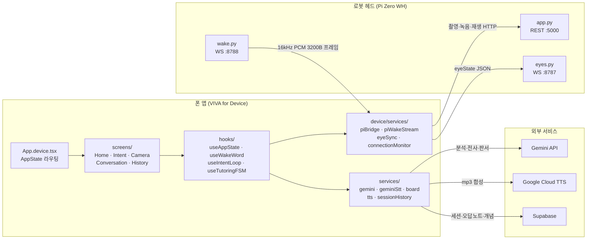
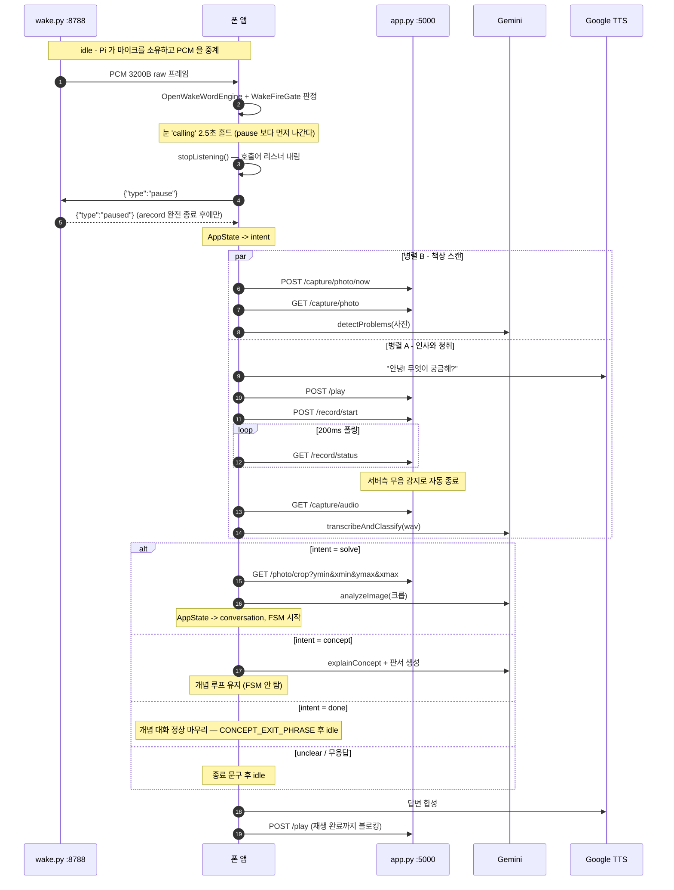
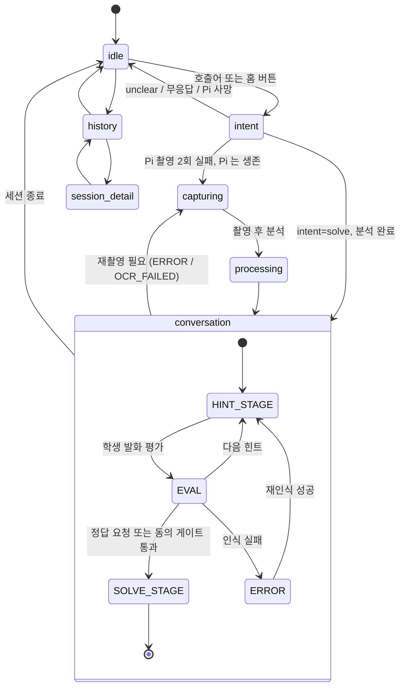

# VIVA 소프트웨어 기술 가이드 (VivaMVP)

이 문서는 **`VIVA for Device`** — 로봇 헤드와 페어링되는 폰 앱 — 의 소프트웨어 단일 진실원이다.
본문의 모든 설명은 로봇이 붙어 있는 상태를 전제로 한다.

- 앱 소스: `viva-merged/`
- 하드웨어(기구·결선·부품): [`../VivaHW/README.md`](../VivaHW/README.md)
- Pi 서버 설치 절차: [`viva-merged/pi-server/README.md`](viva-merged/pi-server/README.md)
- 엔지니어링 로그(모든 수치의 1차 출처): [`viva-merged/docs/process.md`](viva-merged/docs/process.md)

---

## 1. 개요

VIVA 는 중학교 3학년 수학을 소크라테스식으로 가르치는 AI 튜터다. 제품은 **폰 앱 + 로봇 헤드** 한 쌍으로 동작하며, 역할이 명확히 갈린다.

| | 폰 앱 (VIVA for Device) | 로봇 헤드 (Pi Zero WH) |
|---|---|---|
| 역할 | 두뇌 | 감각기관 |
| 담당 | 호출어 판정, 의도 분류, Gemini 추론, 튜터링 FSM, TTS 합성, 판서 생성, Supabase 적재 | 마이크 캡처, 카메라 촬영, 스피커 재생, 눈 디스플레이 렌더 |
| 코드 | `viva-merged/App.device.tsx` + `viva-merged/src/` | `viva-merged/pi-server/` |

헤드는 의도적으로 얇다. ONNX 호출어 엔진도 Gemini 호출도 Pi 에 올리지 않는다 — Pi Zero 는 싱글코어 ARMv6 이고, 12MP JPEG 인코딩만으로도 이미 코어를 다 쓴다. Pi 는 마이크 PCM 을 폰으로 중계하고, 사진을 찍어 넘기고, 폰이 합성해 보낸 mp3 를 재생할 뿐이다.

### 기술 스택

| 층 | 사용 기술 | 근거 파일 |
|---|---|---|
| 앱 프레임워크 | React Native 0.74.5 + Expo SDK 51 (CNG) | `viva-merged/package.json` |
| 언어 | TypeScript 5.3 / Python 3 (Pi) | `viva-merged/tsconfig.json` |
| 호출어 | openWakeWord ONNX (`비바야`), onnxruntime-react-native 1.18.0 고정 | `viva-merged/src/lib/openWakeWord.ts` |
| 추론 | Gemini 텍스트 `gemini-3.7-flash`, 이미지 `gemini-3.1-flash-image` | `viva-merged/src/services/gemini.service.ts`, `viva-merged/src/services/board.service.ts` |
| 음성 합성 | Google Cloud TTS REST, `ko-KR-Chirp3-HD-Aoede` | `viva-merged/src/services/tts.service.ts` |
| 백엔드 | Supabase (Postgres + Storage) | `viva-merged/src/lib/supabase.ts` |
| Pi 서버 | Flask (REST :5000) + websockets (:8788 / :8787) | `viva-merged/pi-server/app.py` |

모델 ID 의 코드측 폴백은 `gemini.service.ts` 의 `DEFAULT_TEXT_MODEL_ID` **한 곳**에만 있다. 새 파일에서 모델 기본값이 필요하면 리터럴을 다시 박지 말고 그 상수를 import 할 것 — 예전에 세 파일에 각각 박혀 있었고, `.env` 만 올린 뒤 `.env` 없는 환경이 조용히 다른 모델을 쓰는 상태가 됐다.

---

## 2. 아키텍처



세 채널은 목적이 다르고, 실패 방식도 다르다.

- **REST :5000** — 요청/응답 단발. 대화 한 턴은 half-duplex 턴제라 지속 스트리밍이 필요 없다. 모든 호출은 `piBridge.service.ts` 의 `fetchWithTimeout()` 을 지나며 엔드포인트별로 다른 타임아웃을 쓴다(아래 §10).
- **wake WS :8788** — Pi 가 유휴 시 마이크를 단독 소유하고 PCM 을 밀어준다. 호출어 판정은 폰이 한다.
- **eyes WS :8787** — 폰이 눈 상태를 밀어넣는 단방향 채널. **없어도 앱은 정상 동작한다** — `EXPO_PUBLIC_EYE_SYNC_WS_URL` 이 비어 있으면 서비스 자체가 꺼지고 눈만 안 움직인다.

**연결 판정은 단 하나의 주체가 한다.** `device/services/connectionMonitor.service.ts` 의 `GET /health` 5초 폴링이 유일한 판정자이고, 눈 WS 끊김이나 piBridge 호출 실패는 상태를 직접 바꾸지 않고 "지금 당장 재프로브" 트리거로만 쓴다. 채널별 liveness 를 그대로 노출하면 과거의 3파편(piReadyRef / 눈 WS / 웨이크 WS) 문제를 화면 수만큼 복제하게 된다. `connected` 상태에서만 2연속 실패를 요구하는 2-strike 규칙이 있는데, 이것도 단발 `/health` 타임아웃이 `connected` 를 플랩시켜 진행 중인 턴의 발화를 삼켰기 때문에 생긴 것이다.

---

## 3. 디렉토리

`viva-merged/` 루트:

| 경로 | 내용 |
|---|---|
| `App.device.tsx` | 디바이스 셸. `AppState.status` 로 화면을 라우팅한다. |
| `App.phone.tsx` | 폰 단독판 셸 (§12 부록). |
| `app.config.js` | Expo 설정. `APP_VARIANT` 로 두 앱을 가른다. |
| `babel.config.js` | `@app` alias 를 variant 별 셸로 푼다. |
| `metro.config.js` | `.onnx` 에셋 등록 + variant 별 캐시 분리. |
| `plugins/` | `withBackgroundActions.js` — Android FGS 매니페스트 주입. |
| `patches/` | `patch-package` 패치 3종. `npm install` 의 postinstall 이 자동 적용. |
| `pi-server/` | Pi 쪽 Python 서버 일체 (§10). |
| `supabase/` | 마이그레이션 SQL + 개발 데이터 초기화 (§7). |
| `tools/` | 개발 스크립트(개념 이미지 생성, 채팅 export, 눈 WS 테스트 서버). 앱 번들에는 안 들어간다. |
| `docs/` | 엔지니어링 로그와 스펙. `process.md` 가 중심. |

`viva-merged/src/`:

| 경로 | 역할 | 대표 파일 |
|---|---|---|
| `device/` | **로봇 연동 전용.** 폰 단독판 번들에는 들어가지 않는다. | `services/piBridge` · `services/piWakeStream` · `services/eyeSync` · `services/connectionMonitor` · `services/backgroundKeepAlive` · `hooks/useIntentLoop` · `hooks/usePiConnection` · `screens/HomeScreen` · `screens/IntentScreen` · `screens/ConversationScreen` · `screens/WifiProvisionScreen` |
| `phone/` | 폰 단독판 전용 화면 (§12 부록). | `screens/HomeScreen` · `screens/ConversationScreen` |
| `hooks/` | 두 variant 공용 상태 로직. | `useAppState` · `useTutoringFSM` · `useWakeWord` · `useVoiceInput` · `useSolveMode` |
| `services/` | 외부 API 및 영속화. | `gemini` · `geminiStt` · `board` · `tts` · `sessionHistory` · `sessionLog` · `sessionDebug` · `apiPricing` · `concepts` |
| `lib/` | 얇은 클라이언트/엔진 래퍼. | `supabase` · `openWakeWord` · `wakeFireGate` · `deviceId` · `uploadFile` |
| `prompts/` | Gemini 시스템 프롬프트 조립. | `system_prompt` · `conceptBoardPrompt` |
| `utils/` | 순수 함수. 테스트가 가장 촘촘한 층이다. | `captureDecision` · `problemChoice` · `mathTextProcessor` · `subtitleSchedule` · `cropImage` · `mp3Duration` · `sttPostProcessor` · `wavEncode` · `wifiQr` · `wifiCredsStore` · `currentSsid` |
| `types/` | 도메인 타입. | `AppState` · `Tutoring` · `SessionHistory` · `ApiUsage` |
| `components/` | 공용 뷰. | `BoardView` · `CharacterView` · `EyeAnimation` · `ProcessingView` · `SolveModeToggle` · `MicLevelIndicator` |
| `screens/` | 두 variant 가 같이 쓰는 화면. | `CameraScreen` · `HistoryScreen` · `SessionDetailScreen` |
| `assets/` | 호출어 ONNX 모델과 아이콘. | `wakeword/` |
| `theme.ts` | 디자인 토큰의 **유일한 원본**. 색·폰트는 반드시 여기서 import 한다. | — |

`src/device/` 와 `src/phone/` 의 분리는 단순한 정리가 아니라 번들 경계다. 폰 단독판을 빌드하면 `@app` alias 가 `App.phone.tsx` 를 가리키고, `device/` 아래 모듈은 어느 import 사슬로도 닿지 않아 번들에서 통째로 빠진다.

---

## 4. 한 턴의 데이터 흐름

호출어 한 번부터 첫 답변까지의 경로다. 실제 지연은 홈 버튼 기준 약 19.6초(촬영 13.1 + 전송 0.4 + 1차 분석 6.1, 2026-07-29 실기기 실측)이고, 이 시간을 가리는 것이 인사 발화와 눈 표정 연출의 존재 이유다.



### 각 단계가 사는 파일과 알아둘 것

**1) 호출어 — `src/device/services/piWakeStream.service.ts`, `src/lib/wakeFireGate.ts`**

Pi 는 16kHz mono S16_LE PCM 을 100ms(3200바이트) 단위 **raw 바이너리** WS 프레임으로 보낸다. base64/JSON 래핑을 안 하는 이유는 Pi Zero 단일 코어에서 인코딩 CPU 와 +33% 페이로드를 아끼기 위해서다. 인코딩은 여유 있는 폰이 한다.

판정은 `WakeFireGate` 가 한다. 임계값을 넘은 홉이 **2연속**이어야 발화하는데, 기침·박수 같은 단발 트랜지언트가 1홉만 넘고 실제 "비바야"(약 0.6초)는 연속 홉에서 넘기 때문이다. 대가는 감지가 1홉(약 300ms) 늦어지는 것. 다만 `OWW_STRONG_SCORE`(0.3) 이상인 단일 홉은 연속 확인 없이 즉시 발화하는데, 실기기에서 실발화 점수가 0.387 → 0.025 로 떨어져 2연속 요구에 막히는 사례(10회 중 1회 인식)가 나왔기 때문이다.

PCM 워치독도 여기 있다. 구독 중인데 5초간 한 조각도 안 오면 좀비 소켓으로 보고 끊었다 다시 붙인 뒤 `resume` 을 다시 보낸다 — `subscribe` 만으로는 Pi 쪽 좀비 `arecord` 를 못 죽인다.

**2) 마이크 소유권 hand-off — `App.device.tsx` 의 `beginCapture()`**

`piWakeStream.pause()` 를 부르고 **`paused` ack 을 기다린 뒤에야** Pi 녹음을 시작한다. `wake.py` 의 계약이 "arecord 를 terminate + wait 로 완전히 죽인 뒤에야 paused 를 응답한다" 이고, 이 순서가 두 arecord 의 `micboost` 경쟁을 막는다. ack 은 5초 상한이 걸려 있어 Pi 가 죽어도 버튼이 먹통이 되지 않는다.

`beginCapture` 는 AF 선행(`prewarmPiFocus`)을 **부르지 않는다.** 한때 "마이크 정리 시간에 AF 를 숨긴다" 였는데 실측 이득이 0 이었다. 호출어를 부르면 곧바로 찍으므로 겹칠 죽은 시간이 없고, prewarm 과 capture 가 거의 동시에 도착해 `_capture_lock` 을 두고 경합만 한다. 어느 쪽이 이기든 버튼~사진이 약 12.7초로 같다. AF 선행이 실제로 값을 하는 곳은 덮을 발화가 있는 **대화 중 재촬영** 하나뿐이라 거기만 남겼다.

**3) 서버측 무음 감지 — `pi-server/app.py`**

로봇 마이크 모드에서 앱은 스트리밍 PCM 이 없어 침묵을 볼 수 없다. 그래서 Pi 가 RMS 를 보고 종료를 판정한다.

| 상수 | 기본값 | 의미 |
|---|---|---|
| `VIVA_SILENCE_MS` | `2000` | 발화 감지 후 이만큼 조용하면 자동 종료 |
| `VIVA_SILENCE_THRESHOLD` | `0.009` | 발화로 칠 RMS 하한 (0~1) |
| `VIVA_SPEECH_MIN_CHUNKS` | `3` | 발화 시작 인정에 필요한 연속 초과 청크 수 (1청크 = 100ms) |
| `VIVA_SILENCE_RESET_MIN_CHUNKS` | `2` | 침묵 타이머 리셋에 필요한 연속 초과 청크 수 |
| `MAX_RECORDING_SECONDS` | `30` (env 없음) | 무발화 시 상한 |

임계값 0.009 는 튜닝 결과다. 잡음 블립과 조용한 원거리 발화는 **크기 대역이 겹쳐(0.01~0.02) 크기만으로는 못 가른다** — 가르는 것은 지속시간이다. 블립은 1청크, 발화는 수백 ms 지속한다. 그래서 임계값은 잡음 바닥(약 0.005) 바로 위까지 내리고 대신 연속 3청크를 요구한다. 방이 바뀌면 `journalctl -u viva-server` 의 `record done ... peak_rms` 실측을 보고 env 로 조정한다.

**4) 의도 루프 — `src/device/hooks/useIntentLoop.ts`**

촬영과 청취를 병렬로 돌린다. 촬영이 12초 넘게 걸리는데 그동안 학생을 침묵 속에 세워둘 수 없기 때문이다.

- 청취 폴링 주기는 200ms(`pollIntervalMs`), 무응답 타임아웃은 8초(`noSpeechTimeoutMs`), 루프 상한은 10턴(`MAX_TURNS`, 폭주 방지용).
- `startRecording()` 이 **실제로 성공한 뒤에** `listening` 을 표시한다. 순서가 뒤집혀 있으면 화면이 먼저 "듣는 중"으로 바뀌어 학생이 마이크가 열리기 전에 말을 시작해 첫 마디가 잘렸다.
- 자막은 항상 `speak()` 의 `onPlay` 콜백 **이후에만** 띄운다. 미리 띄우면 TTS 합성 왕복(1~2.5초)만큼 자막이 나레이션을 앞선다. 합성이 죽어 소리를 못 내는 경우에만 catch 폴백으로 자막을 남긴다. `onPlay` 자체의 발화 시점도 계약이다 — sink(로봇 스피커) 경로에서는 mp3 **업로드 완료** 순간에 온다 (6) 참조, 2026-08-20).
- 사전분석(`detectProblems`)이 아직 안 끝났으면 `FILLER_PHRASE`("잠깐만, 책상 좀 볼게!") 한 마디로 흡수한다.
- 의도는 네 갈래다. `solve` 는 `runSolve()`, `unclear` 는 `UNCLEAR_EXIT_PHRASE`, **`done`("이해했어" / "이제 됐어")은 `CONCEPT_EXIT_PHRASE` 로 개념 대화를 정상 종료**하며, 그 밖은 전부 개념 턴(`runConceptTurn`)으로 떨어진다. 무응답도 개념 턴을 한 번이라도 돈 뒤라면 `NO_SPEECH_EXIT_PHRASE` 대신 `CONCEPT_EXIT_PHRASE` 로 끝낸다 — 이야기를 하다 만 것이 아니라 끝난 것으로 읽히게.
- **키보드 입력 경로의 계약이 음성과 다르다.** `switchToText()` 로 텍스트 모드에 들어가면 폴링 루프가 오디오 판정을 통째로 건너뛰어 **무응답 타임아웃이 멈추고**, 그 턴을 끝낼 수 있는 것은 `submitText()` 하나뿐이다(음성 경로는 녹음 종료 또는 8초 무응답으로도 끝난다). 비바가 말하는 중에 제출한 문장은 큐에 담겼다가 다음 청취가 열리자마자 집어간다. 텍스트는 STT 를 타지 않고 `classifyText()` 로 의도만 분류하며, 분기는 음성과 동일하다. `switchToVoice()` 는 무응답 타임아웃의 기준 시각을 리셋한다 — 안 그러면 타이핑에 쓴 시간 때문에 복귀 즉시 무응답으로 빠진다.
- 모든 외부 의존성이 `deps` 로 주입 가능하다. 테스트는 모듈 mock 없이 fake deps 로 돈다.

**5) 튜터링 FSM — `src/hooks/useTutoringFSM.ts`**

`TutoringSession` 의 `hintCount` · `wrongStreak` · `boardRegenerationCount` · `lastBoardImageBase64` · `fsmState` 를 소유한다. 소크라테스식 진행(힌트 → 학생 답 평가 → 정답 공개)과 재인식 사다리(보관본 크롭 재분석 → 영역 재촬영 → 폰 카메라 제안)가 전부 여기 있다.

무한루프 방지 규칙: `wrongStreak >= 3`(`WRONG_STREAK_CONSENT_THRESHOLD`)이면 정답 공개 전에 학생 동의를 요구한다. 동의 질문 자체는 Gemini 가 프롬프트 지시대로 하지만, **"그 동의에 실제로 응했는지"의 판정은 훅이 로컬 정규식(`isConsentPhrase`)으로 한다** — 모델의 말투에 게이트를 맡기지 않는다.

**6) TTS 와 재생 — `src/services/tts.service.ts`, `piBridge.playAudioOnPi()`**

`tts.service` 는 Google TTS REST 로 mp3(base64)를 합성한 뒤, 등록된 `AudioSink` 가 있으면 폰 스피커 대신 그쪽으로 보낸다. sink 를 등록·해제하는 것은 화면(`device/screens/ConversationScreen.tsx`, `device/screens/IntentScreen.tsx`)의 책임이고, `tts.service` 는 sink 가 Pi 로 보내는지 어떤지 모른다.

`speak()` 의 Promise 는 **재생이 끝나야** resolve 한다. `/play` 도 재생 완료까지 응답하지 않으므로 이 계약이 로봇 경로에서도 그대로 유지된다. `/play` 요청에는 요청당 고유 `req_id` 가 붙는데, iOS 네트워크 스택이 응답 유실 시 POST 를 재전송해 같은 문구가 두 번 재생되는 사고(2026-08-13)가 있었기 때문이다. Pi 는 같은 id 를 다시 받으면 `{"status":"duplicate"}` 로 답하고 재생하지 않는다.

자막 시계(`onPlay`)는 sink 경로에서 **mp3 업로드가 끝난 순간**에 시작한다 — `AudioSink.play` 의 `onStarted` 콜백을 `playAudioOnPi` 가 XHR upload 이벤트로 부른다 (2026-08-20). 예전엔 `sink.play` 호출 직전에 무조건 불려서, 업로드 시간(mp3 크기 비례 — 짧은 튜터링 턴은 수십 ms, 긴 개념 설명은 수백 ms~1초+)만큼 자막이 나레이션을 앞섰다. fetch 로는 못 잡는다 — RN fetch 는 업로드 진행을 노출하지 않고, `/play` 응답은 재생 종료 후에야 온다. `onStarted` 를 안 부르는 sink 여도 `play` 종료 후 폴백으로 자막은 반드시 돈다(무음 재생 실패 시 자막이 내용을 전달하는 정책). 남는 오차는 Pi 쪽 mpg123 기동뿐이라 발화 길이와 무관하게 균일하다.

### Gemini 왕복 상세 — 함수 · JSON · 스키마 · 프롬프트

위 흐름에서 Gemini 로 나가는 호출은 아래 10종이 전부다. 전송 형태는 전부 같다 — `@google/generative-ai` SDK 의 `model.generateContent(parts)` 이고, `parts` 는 `{ text }` 와 `{ inlineData: { mimeType, data } }`(base64 JPEG/WAV) 파트의 배열이다. 응답 형식은 프롬프트로 부탁하지 않고 **모델 인스턴스 생성 시 `generationConfig.responseSchema` 로 강제**한다 — 그래서 호출 목적마다 스키마가 다르고, 모델 인스턴스도 스키마별로 따로 캐시된다(같은 모델 id 라도 인스턴스는 별개다). 키·모델 id 는 §6 의 env 가, 폴백은 §1 의 `DEFAULT_TEXT_MODEL_ID` 가 결정한다.

| 함수 | 파일 | 언제 (§4 흐름) | 첨부 | 응답 스키마 |
|---|---|---|---|---|
| `transcribeAndClassify()` | `src/services/geminiStt.service.ts` | 의도 루프 — 첫 발화의 전사+의도분류 통합 1회 | WAV | `CLASSIFY_SCHEMA` |
| `classifyText()` | 〃 | 의도 루프 — 키보드 입력의 의도분류 (전사 없음) | 없음 | 〃 |
| `detectProblems()` | `src/services/gemini.service.ts` | 의도 루프 — 병렬 책상 스캔 (문제 개수·bbox 만) | 책상 사진 | `DETECT_SCHEMA` |
| `explainConcept()` | 〃 | 개념 턴 (`useIntentLoop.runConceptTurn`) | 직전 판서 (있으면) | `CONCEPT_SCHEMA` |
| `analyzeImage()` | 〃 | solve 확정 후 첫 분석·재촬영 재분석 (`useTutoringFSM`) | 문제 사진(크롭) | `RESPONSE_SCHEMA` (통합) |
| `evaluateStudentInput()` | 〃 | 튜터링 매 턴의 EVAL (`useTutoringFSM`) | 전사본 판서 | 〃 |
| `recognizeHandwriting()` | 〃 | 손글씨 되묻기 — FSM 이 **3회 병렬** 호출해 투표 | 크롭 사진 | `RECOGNITION_SCHEMA` |
| `transcribeWavWithGemini()` | `src/services/geminiStt.service.ts` | 대화 중 학생 발화 전사 (`useVoiceInput`) | WAV | 없음 — plain text |
| `generateBoardImage()` | `src/services/board.service.ts` | 판서 생성. **유일한 이미지 모델 호출** | 문제 사진 또는 직전 판서 | `responseModalities: ['IMAGE']` |
| `verifyBoardImage()` | 〃 (비공개 — `generateVerifiedBoardImage()` 가 생성→검증→교정 재생성을 orchestrate) | 판서 사후검증 (텍스트 모델) | 원본 사진 + 생성 판서 | `VERIFY_SCHEMA` |

모든 호출이 공유하는 계약:

- **재시도** — 텍스트 호출은 429/503 에 1s → 2s → 4s 지수 백오프(`RETRY_BACKOFF_MS`), 구조화 JSON 파싱 실패 시 1회 재요청(`parseResponseWithOneRetry`). 이미지 호출은 1s → 2s 2회 — 검증 불합격 재생성이 첫 생성 직후 연달아 나가며 레이트리밋에 걸린 사고의 산물이다.
- **`cleanJsonResponse()`** — 모델이 `\frac` 를 이스케이프 없이 내면 `JSON.parse` 가 `\f` 를 제어문자로 삼켜 깨진다. 알려진 LaTeX 매크로를 이중 이스케이프해 방어한다.
- **`usageMetadata` → `toTokenUsage()`** — 매 응답의 토큰 사용량을 세션 `usage` 로 누적해 `apiPricing.service.ts` 가 비용을 집계한다.
- **`thinkingConfig` 분기** — 모델 id 가 `gemini-3*` 이면 `{ thinkingLevel: 'low' }`, 2.5 계열이면 `{ thinkingBudget: 0 }` (필드명이 달라 섞으면 400). 'low' 는 지연을 위한 선택이고, EVAL 판정 정확도가 떨어지면 올리는 것이 트레이드오프다.

<details>
<summary>요청 / 응답 JSON — 실제로 오가는 모양</summary>

SDK 가 아래 REST 형태로 감싼다. 대표로 EVAL 턴(`evaluateStudentInput`):

```jsonc
// POST https://generativelanguage.googleapis.com/v1beta/models/gemini-3.7-flash:generateContent
{
  "contents": [{ "parts": [
    // 이미지가 반드시 첫 파트다. Gemini implicit prompt caching 은 직전 요청과
    // 바이트 단위로 동일한 "앞부분"만 할인하는데, 시스템 프롬프트를 앞에 두면
    // hintCount/wrongStreak 가 턴마다 바뀌어 prefix 가 절대 일치하지 않는다.
    // 세션 내내 같은 바이트인 전사본 판서가 앞에 오면 그 구간(턴 비용의
    // 대부분)이 캐시 할인을 받는다 (2026-07-31 비용 분석).
    { "inlineData": { "mimeType": "image/jpeg", "data": "<전사본 판서 base64>" } },
    { "text": "<buildSystemPrompt(...) 전문 — 아래 프롬프트 드롭다운>" },
    // TutoringSession 직렬화. 모델 판단에 안 쓰이는 필드(usage, sessionId,
    // boardRegenerationCount, 이미지 2종, history)는 뺀다 - 토큰 낭비 +
    // usage 는 턴마다 바뀌어 캐시 prefix 도 깨뜨린다.
    { "text": "Session context: {\"fsmState\":\"EVAL\",\"hintCount\":2,\"wrongStreak\":1,\"finalAnswer\":\"③ (x=2)\",...}" },
    { "text": "Tutor: 이항하면 부호가 어떻게 될까?" },   // history 마지막 4개만
    { "text": "Student: 음 그대로?" },
    { "text": "Student: 아 반대로 바뀌어" }               // 이번 턴 입력
  ]}],
  "generationConfig": {
    "responseMimeType": "application/json",
    "responseSchema": { /* RESPONSE_SCHEMA */ },
    "thinkingConfig": { "thinkingLevel": "low" }
  }
}
```

`analyzeImage`(첫 분석)는 파트 순서가 다르다: 시스템 프롬프트 → `Session context` → (촬영 직전 학생 발화가 있으면 `Before taking this photo, the student said: ...`) → 사진. 캐시할 "직전 요청과 같은 prefix" 가 없는 1회성 호출이라 순서 최적화 대상이 아니다.

응답은 `RESPONSE_SCHEMA` 를 그대로 채운 JSON 한 덩어리다(타입: `src/types/Tutoring.ts` 의 `GeminiTutoringResponse`):

```json
{
  "fsm_state": "HINT_STAGE",
  "explicit_answer_request": false,
  "student_dismissal": false,
  "is_on_correct_path": false,
  "requires_board": false,
  "board_update_needed": false,
  "message": "거의 다 왔어. 3번째 줄에서 이항할 때 부호를 안 바꿨네. 그 줄만 다시 해볼래?",
  "board_prompt": "",
  "confidence": 0.92,
  "error_type": "NONE",
  "misconception_type": "SIGN_ERROR",
  "mistake_reason": "이항할 때 부호를 바꾸지 않음",
  "topic": "이차방정식",
  "title": "59번 이차방정식",
  "problem_facts": "",
  "final_answer": "③ (x=2)",
  "answer_not_in_choices": false,
  "annotations": [
    { "type": "arrow", "box_2d": [420, 130, 480, 520], "text": "3번째 줄 이항" }
  ]
}
```

</details>

<details>
<summary>통합 스키마(RESPONSE_SCHEMA) — 필드별 역할</summary>

`analyzeImage` / `evaluateStudentInput` 가 공유하는 스키마다. 필드 하나하나가 FSM 의 분기 입력이라, `required` 에서 빠지면 모델이 생략하고 해당 정책이 조용히 무력화된다 — `problem_facts`/`final_answer` 가 required 인 이유다.

| 필드 | 역할 | 소비하는 곳 |
|---|---|---|
| `fsm_state` | 이번 턴의 정책 단계 (§5 FSM state) | `useTutoringFSM` 분기 |
| `message` | TTS + 자막으로 나가는 발화 본문. LaTeX 계약(`\sqrt{5}` 등)은 `mathTextProcessor` 가 양방향 렌더 | `speak()` / 자막 |
| `confidence` | **수학 실력이 아니라 "이미지를 제대로 읽었는가"** 의 자기평가. 0.6 미만이면 앱이 재촬영을 요청한다 | 재인식 사다리 |
| `error_type` | ERROR 의 사유. `OCR_FAILED` 가 로봇 자동 재촬영의 유일한 트리거 — 산문으로 "다시 찍어줘"라고만 말하면 앱은 움직이지 않는다 | 재촬영 경로 |
| `is_on_correct_path` | 학생 수학의 정오 판정 (판정 불가면 null) | `wrongStreak` 누적 |
| `explicit_answer_request` | 정답 공개 동의 게이트 통과 신호. 동의 문구 판정 자체는 훅의 로컬 정규식이 한다 (§4-5) | SOLVE_STAGE 전이 |
| `student_dismissal` | "알았어 꺼져" 류 하차 신호. 앱이 고정 인사로 세션을 닫는다 | 세션 종료 |
| `requires_board` / `board_update_needed` / `board_prompt` | 판서가 필요한가 / 다시 그려야 하는가 / 무엇을 그릴 것인가 — `generateVerifiedBoardImage` 의 입력 | 판서 파이프라인 |
| `annotations[]` | 전사본 판서 위 오버레이 명령 `{type, box_2d, text}`. box_2d 는 첨부 이미지 기준 0~1000 정규화. **이미지를 다시 그리지 않고** 앱이 위에 그린다 | `BoardAnnotationOverlay` |
| `problems[]` | 사진 속 문제 감지 `{label, box_2d}`. 2개 이상이면 앱이 고정 문구로 되묻고 크롭 좌표로 쓴다 | 다문제 되묻기 / `/photo/crop` |
| `problem_facts` | 문제 원문의 충실한 전사 — 판서 생성의 ground truth + 사후검증 대조 기준. 사진 없는 턴은 `""` | `board.service` |
| `final_answer` | 첫 분석 턴에 1회 도출해 세션에 고정하는 정답. 이후 모든 턴이 이 값을 참조한다 — 턴마다 독립 재풀이하다 답이 갈리는 사고의 방지책 | 채점 / recap / 판서 검증 |
| `answer_not_in_choices` | 객관식 self-check 실패(계산 답이 전사한 선지에 없음) = 선지 오인식 가능성. FSM 이 재인식 사다리를 태운다 | 재인식 사다리 |
| `misconception_type` / `mistake_reason` | 오답 유형 분류 + "왜 틀렸는지" 한 줄. `OCR_UNCERTAIN` 은 "판독 불확실"을 앱에 알리는 유일한 통로 | 오답노트 |
| `topic` / `title` | 단원 분류(enum 9종) + 히스토리 카드 제목 | `sessionHistory` |

</details>

<details>
<summary>경량 스키마 5종 — 왜 통합 스키마를 안 쓰나</summary>

판독만 시키는 호출에 채점·판서 필드를 딸려 보낼 이유가 없다. 실측으로 통합 호출은 8,188토큰, 인식 전용은 1,109토큰 — 이 차이가 3회 병렬 판독 같은 패턴을 감당 가능하게 만든다.

| 스키마 | 정의 위치 | 형태 | 역할 |
|---|---|---|---|
| `RECOGNITION_SCHEMA` | `gemini.service.ts` | `{ candidates: string[] }` | 손글씨 최종 답의 판독 후보 목록. 후보 개수·일치 여부로 FSM 이 되묻기를 판정한다. 캐시하지 않는다 — 매번 독립 표본이어야 투표가 의미를 갖는다 |
| `DETECT_SCHEMA` | 〃 | `{ problems: [{label, box_2d}] }` | 통합 스키마의 `problems` 필드만 떼어낸 서브셋. 의도 루프의 백그라운드 사전분석용 |
| `CONCEPT_SCHEMA` | 〃 | `{ message, board_prompt, concept_id }` | 개념 턴 응답. `concept_id` 는 등록된 개념 도해 매칭 — 환각 id 는 `normalizeConceptId()` 가 `''` 로 걸러낸다 |
| `CLASSIFY_SCHEMA` | `geminiStt.service.ts` | `{ transcript, intent }` | 전사+의도분류. `intent` 는 `solve\|concept\|unclear\|done` enum — §4-4 의 네 갈래 분기가 이 값이다. 전사가 빈 문자열이면 intent 와 무관하게 `unclear` 처리 |
| `VERIFY_SCHEMA` | `board.service.ts` | `{ pass, issues: string[] }` | 판서 사후검증 판정. `issues` 는 한국어 교정 지시 목록으로, 불합격 시 그대로 재생성 프롬프트의 `CORRECTION NOTES` 가 된다 |

`transcribeWavWithGemini` 만 스키마가 없다 — 출력이 전사문 한 줄이라 JSON 강제가 오히려 짐이다. 대신 plain-text 전용 모델 인스턴스를 따로 캐시한다.

</details>

<details>
<summary>시스템 프롬프트가 사는 곳</summary>

**튜터링 통합 프롬프트 — `src/prompts/system_prompt.ts` 의 `buildSystemPrompt(context)`.** 고정 문자열 하나가 아니라 정책 블록 상수들의 조건부 조립이다:

| 블록 | 내용 |
|---|---|
| `IDENTITY` / `TONE_POLICY` / `RESPONSE_STYLE` | 소크라테스식 튜터 정체성, 반말 강제, 3문장 상한 + "매 턴 대답하기 쉬운 질문으로 끝내라" |
| `FSM_STATE_POLICY` / `EXPLICIT_SOLVE_REQUEST_POLICY` / `ANSWER_CONFIRMATION_POLICY` / `WRONG_STEP_POLICY` | 단계별 행동 규칙 — 힌트 단계 정답 금지, 동의 게이트, 정답 도달 시 recap 형식, 오답 지적 방식 |
| `BOARD_PROMPT_POLICY` / `ANNOTATION_POLICY` | 판서를 언제 그리고 언제 오버레이로 때우는가 |
| `ERROR_POLICY` / `PROBLEM_DETECTION_POLICY` / `PROBLEM_FACTS_POLICY` / `FINAL_ANSWER_POLICY` / `STUDENT_SOLUTION_POLICY` | 사진 턴 전용 — 재촬영 유도, 문제 감지, 원문 전사, 정답 고정, 손풀이 판독 |
| `DIRECT_SOLVE_POLICY` | "바로 정답" 모드. 힌트 계열 정책과 **섞지 않고 대체**한다 — 섞으면 더 강한 힌트 지시가 이겨서 정답 모드가 안 먹혔다 |
| `SESSION_METADATA_POLICY` / `OUTPUT_FORMAT_POLICY` | topic/title 규칙, LaTeX 표기 계약, 필드별 채움 규칙 |

조립 규칙이 곧 비용·정확도 정책이다:

- `freshPhoto` 일 때만 사진 판독 정책(감지·전사·손풀이)이 들어간다 — EVAL 턴 첨부는 전사본이라 같은 지시를 반복하면 모델이 사본을 재전사한 값을 앱이 버리는 낭비만 생긴다.
- `boardAttached` 일 때만 `ANNOTATION_POLICY` — 좌표 기준 이미지가 전사본일 때만 오버레이 좌표를 받는다.
- 턴마다 바뀌는 두 줄(`hintIntensityInstruction(hintCount)`, `wrongStreakInstruction(wrongStreak)`)은 **맨 끝**에 둔다 — 중간에 있으면 그 뒤의 불변 정책 ~2,000토큰이 implicit caching 의 동일 prefix 에서 탈락한다.

**호출별 인라인 프롬프트 — 서비스 파일 안의 상수.** 단일 목적 호출은 프롬프트도 호출부 옆에 산다:

| 상수 | 파일 | 용도 |
|---|---|---|
| `RECOGNIZE_PROMPT` | `gemini.service.ts` | 손글씨 판독. 소극적 지시("보이는 획만, 지어내지 마라")를 유지한다 — "적극 생성하라"로 시키면 안 보이는 값을 100% 지어냈다 |
| `DETECT_PROMPT` | 〃 | 책상 사진 문제 감지 |
| `CONCEPT_PROMPT` + `NEW_CONCEPT_RULE` | 〃 | 개념 설명 턴. 힌트 게이트 없이 바로 답하되, 새 개념 첫 설명엔 시각 자료 강제 |
| `TRANSCRIBE_PROMPT` / `CLASSIFY_PROMPT` | `geminiStt.service.ts` | 전사 / 전사+의도분류. "오"를 감탄사가 아니라 숫자 5 로 적게 하는 정규화 규칙 포함. 직전 비바 발화를 200자까지 문맥 힌트로 덧붙인다 |
| `TRANSCRIPTION_INSTRUCTION` / `annotationRules` (함수 내 조립) | `board.service.ts` | 판서 이미지 모델 지시 — 전사 충실성 규칙, 색 팔레트, 학생 손글씨 불가침("SACRED"), SOLVE_STAGE 여부에 따른 정답 표기 허용/금지 분기 |
| `verifyBoardImage` 내 검증 프롬프트 | 〃 | 판서 vs 원본 사진 + `problem_facts` 대조. "확신 없으면 pass" — 오탐 1건 = 재생성 $0.067 |
| `CONCEPT_BOARD_RULES` / `conceptBoardPrompt()` | `src/prompts/conceptBoardPrompt.ts` | 개념 도해 생성 규칙. 런타임 폴백과 사전생성 스크립트(`tools/concept-images`)가 공용하는 순수 모듈 |

</details>

---

## 5. 상태 모델

두 개의 상태 기계가 겹쳐 돈다. **`AppStatus` 는 지금 어떤 화면이 떠 있는가**이고, **FSM state 는 튜터링 대화가 어느 정책 단계인가**이다. 둘은 의도적으로 분리돼 있으며, FSM 은 `AppStatus` 를 직접 건드리지 않고 콜백(`onSessionComplete`, `onCameraNeeded`)으로 셸에 요청만 한다.



### AppStatus 와 화면

| `AppStatus` | 렌더되는 것 (device) | `STATUS_EYE_STATE` 초기값 |
|---|---|---|
| `idle` | `src/device/screens/HomeScreen.tsx` (설정에서 `WifiProvisionScreen` 진입) | `idle` |
| `intent` | `src/device/screens/IntentScreen.tsx` | `conversation` — `useIntentLoop` 가 곧바로 덮어쓴다 |
| `capturing` | `src/screens/CameraScreen.tsx` (폰 카메라 폴백 경로) | `idle` |
| `processing` | `src/components/ProcessingView.tsx` | `listening` |
| `conversation` | `src/device/screens/ConversationScreen.tsx` | `conversation` — 화면의 `getEyeState()` 가 더 정확한 값으로 덮어쓴다 |
| `history` | `src/screens/HistoryScreen.tsx` | `idle` |
| `session_detail` | `src/screens/SessionDetailScreen.tsx` | `idle` |

전이는 전부 `src/hooks/useAppState.ts` 를 지나고, 디바이스 셸은 여기에 `onStatusChange` 를 물려 눈 상태를 미러링한다(`STATUS_EYE_STATE`). `processing` 이 `listening` 눈인 것은 이름이 아니라 연출로 고른 값이다 — 20초 가까이 '?' 를 띄워두는 것보다 정면 고정 + 끄덕임이 "일하고 있다"로 읽힌다.

### FSM state

`src/types/Tutoring.ts` 의 `GeminiTutoringResponse.fsm_state` 로 매 턴 모델이 직접 내려준다.

| 상태 | 의미 |
|---|---|
| `HINT_STAGE` | 힌트를 주고 학생 답을 기다리는 기본 단계 |
| `EVAL` | 학생 발화를 채점·평가하는 턴 |
| `SOLVE_STAGE` | 전체 풀이 공개. 발화가 끝나면 세션 종료 |
| `ERROR` | 인식 실패. `error_type` 이 사유를 가른다 |

`AppStatus` 가 `conversation` 일 때 실려 다니는 데이터는 `src/types/AppState.ts` 의 `ConversationPayload` 다. 여기서 눈여겨볼 필드가 둘 있다.

- `photoSource` — `'pi'` 일 때만 FSM 이 보관본 크롭 흐름(다문제 되묻기, 인식 실패 시 크롭 재분석)을 연다. 폰 사진은 크롭 소스가 없다.
- `resumeSession` — 대화 도중 재촬영으로 `ConversationScreen` 이 언마운트됐다 돌아올 때 같은 세션을 이어받기 위한 스냅샷. 없으면 새 세션이다. `usage` 를 일부러 싣는데, 빼놨더니 재촬영마다 비용 집계가 0 으로 돌아가 4턴짜리 세션이 `textCalls:1` 로 저장됐다.

---

## 6. 환경변수

원본은 [`viva-merged/.env.example`](viva-merged/.env.example) 이다. `cp .env.example .env` 후 값을 채운다. `.env` 는 커밋하지 않는다.

**`EXPO_PUBLIC_` 접두사가 붙은 값은 앱 번들에 평문으로 들어간다.** 서버 전용 비밀키에는 이 접두사를 붙이지 말 것. 또한 이 값들은 babel transform 시점에 리터럴로 인라인되므로, 값을 바꾼 뒤에는 **`expo start -c` 로 Metro 캐시를 비워야** 반영된다(네이티브 재빌드는 불필요).

| 키 | 필수 | 비우면 죽는 것 | 튜닝 여지 |
|---|---|---|---|
| `EXPO_PUBLIC_GEMINI_API_KEY` | 예 | `gemini` / `geminiStt` / `board` 서비스가 즉시 예외. 문제 인식·튜터링·판서 전부 정지 | 없음 |
| `EXPO_PUBLIC_GEMINI_TEXT_MODEL_ID` | 아니오 | 코드 기본값(`DEFAULT_TEXT_MODEL_ID`)으로 동작 | 모델 교체 A/B |
| `EXPO_PUBLIC_GEMINI_IMAGE_MODEL_ID` | 아니오 | `board.service.ts` 기본값으로 동작 | 판서 품질이 부족하면 상위 모델 |
| `EXPO_PUBLIC_GEMINI_IMAGE_SIZE` | 아니오 | `1K` 로 동작 | **주요 노브.** 전사 품질이 떨어지면 `2K`. 단가표(`apiPricing.service.ts`)가 같은 값을 읽으므로 따로 맞출 필요 없다 |
| `EXPO_PUBLIC_SUPABASE_URL` | 예 | 세션 기록·오답노트·개념 이미지 저장 전부 실패 | 없음 |
| `EXPO_PUBLIC_SUPABASE_ANON_KEY` | 예 | 위와 동일 | 없음 |
| `SUPABASE_SERVICE_ROLE_KEY` | 도구 전용 | `tools/concept-images/generate.ts` 등 관리 스크립트만 사용. **앱 번들에 넣지 말 것** | 없음 |
| `EXPO_PUBLIC_GOOGLE_TTS_API_KEY` | 예 | `tts.service` 가 `Missing EXPO_PUBLIC_GOOGLE_TTS_API_KEY` 예외를 던진다. 이 예외를 잡는 곳이 없어 자막도 안 뜨고 그 턴이 멈춘다 | 없음 |
| `EXPO_PUBLIC_PI_HOST` | 아니오 | `piBridge.service.ts` 기본 호스트(`viva.local`) 사용 | **mDNS 가 불안정한 망에서는 IP 를 직접 박는다** (§11) |
| `EXPO_PUBLIC_PI_PORT` | 아니오 | `piBridge.service.ts` 기본 포트(`5000`) 사용 | 없음. Pi 쪽 Flask 포트를 옮겼을 때만 건드린다 |
| `EXPO_PUBLIC_EYE_SYNC_WS_URL` | 아니오 | `eyeSync` 서비스가 통째로 꺼진다. 앱은 정상 동작하고 눈만 안 움직인다 | 예: `ws://viva.local:8787` |
| `EXPO_PUBLIC_INTENT_CAPTURE_DELAY_MS` | 아니오 | `useIntentLoop.ts` 가 병렬 촬영을 지연 없이(`0`) 시작 | 디버깅용. 값을 주면 촬영 시작만 그만큼 민다 |
| `EXPO_PUBLIC_GEMINI_EVAL_MEDIA_RESOLUTION` | 아니오 | 빈 값이면 `gemini.service.ts` 가 옵션 자체를 안 붙여 모델 기본 해상도(로그상 `HIGH`) | `MEDIA_RESOLUTION_MEDIUM` 이면 EVAL 첨부 이미지가 1,120 → 약 560 토큰. 다만 annotations 좌표 정밀도가 떨어지면 되돌린다 |
| `EXPO_PUBLIC_GEMINI_RECOGNITION_MEDIA_RESOLUTION` | 아니오 | 위와 동일. 인식 전용 호출의 해상도 | 실측에서 후보가 벌어져 실기기 측정 전에는 내리지 않는다 |

위 14개가 `.env.example` 템플릿의 전부다. 코드가 읽는 `EXPO_PUBLIC_*` 중 템플릿에 빠진 키는 없다.

Pi 쪽 환경변수(`VIVA_*`)는 앱이 아니라 systemd 유닛에서 준다. §4 의 무음 감지 표와 [`viva-merged/pi-server/README.md`](viva-merged/pi-server/README.md) 를 참고한다.

---

## 7. Supabase

로그인이 없는 MVP 라 `device_id` 로만 사용자를 가른다(`src/lib/deviceId.ts`). RLS 는 켜져 있지만 anon 키에 permissive 정책을 주는 신뢰 모델이다.

### 테이블과 버킷

| 대상 | 종류 | 용도 | 읽고 쓰는 코드 |
|---|---|---|---|
| `viva_sessions` | 테이블 | 세션 1건 = 1행. 대화 메시지, 판서 목록, 카운터, 토큰 사용량, 단원, 틀린 이유, 디버그 스냅샷 | `services/sessionHistory.service.ts` |
| `viva_session_events` | 테이블 | 턴 단위 이벤트 로그(AppState/FSM 전이, confidence, error_type) | `services/sessionLog.service.ts` |
| `concepts` | 테이블 | 검수된 개념 도해 메타. 앱은 익명 read 전용 | `services/concepts.service.ts` |
| `board-images` | 버킷 | 세션 중 생성된 판서 이미지. 경로는 `{deviceId}/{sessionId}/{timestamp}.jpg` | `services/sessionHistory.service.ts` (via `lib/uploadFile.ts`) |
| `attempt-images` | 버킷 | 학생이 촬영한 문제 사진(히스토리 썸네일) | `services/sessionHistory.service.ts` (via `lib/uploadFile.ts`) |
| `concept-images` | 버킷 | 개념 도해 PNG. 앱은 공개 URL 조립만, 쓰기는 service-role 도구 스크립트 전용 | 읽기 `services/concepts.service.ts` / 쓰기 `tools/concept-images/generate.ts` |

### 적용 방법

`supabase/migrations/` 의 SQL 을 **파일명 순서대로** Supabase 대시보드 > SQL Editor 에 붙여넣고 실행한다. anon/publishable 키로는 스키마 변경이 불가능해 스크립트로 자동화할 수 없다.

<details>
<summary>마이그레이션 8개 — 각 파일이 무엇을 추가하는가</summary>

| 파일 | 추가하는 것 |
|---|---|
| `0001_viva_sessions_and_events.sql` | `viva_sessions` · `viva_session_events` 테이블, `(device_id, started_at desc)` 인덱스, 두 테이블의 RLS + permissive 정책, `board-images` public 버킷과 read/insert/update 정책 |
| `0002_attempt_images.sql` | `viva_sessions.problem_image_url` 컬럼, `attempt-images` public 버킷과 정책 |
| `0003_add_topic_column.sql` | `viva_sessions.topic` 컬럼. 단원 분류를 클라이언트 정규식 추측(`guessTopic`) 대신 Gemini 구조화 출력에서 받는다 |
| `0003_viva_sessions_topic.sql` | **위와 완전히 동일한 `add column if not exists topic text`.** 번호가 중복된 쌍둥이 파일이며, `if not exists` 라 둘 다 실행해도 무해하다 |
| `0004_viva_sessions_mistake_reason.sql` | `viva_sessions.mistake_reason` 컬럼. 오답노트의 "틀린 이유" |
| `0005_viva_sessions_debug.sql` | `viva_sessions.debug` jsonb 컬럼. 촬영 단계·판서 실프롬프트·검증 판정 스냅샷 |
| `0006_concepts.sql` | `concepts` 테이블(RLS + public read), `concept-images` public 버킷과 read 정책 |
| `0007_viva_sessions_kind_parent.sql` | `viva_sessions.kind`(기본 `'solve'`)와 `parent_concept_session_id` 컬럼 + 역조회 인덱스. 개념 대화 세션을 같은 테이블에 저장하고 개념 → 풀이 전환을 잇는다 |

**번호가 중복된다.** `0003` 이 두 개이므로 새 마이그레이션은 `0008` 부터 붙인다.

`0007` 은 미적용 인스턴스에서도 앱이 죽지 않는다 — `sessionHistory.service.ts` 가 컬럼 부재 에러를 감지해 두 컬럼을 빼고 재저장한다.

</details>

`supabase/reset-dev-data.sql` 은 개발 데이터 초기화용이다. 테이블·버킷·정책은 그대로 두고 `viva_sessions` / `viva_session_events` 의 행과 `board-images` / `attempt-images` 의 Storage 파일만 지운다. 이것도 SQL Editor 에서 실행해야 한다 — anon 키에는 `storage.objects` 삭제 정책이 없다.

---

## 8. 테스트

`viva-merged/` 에서:

```bash
npm test              # Jest. node -r dotenv/config 로 .env 를 먼저 읽는다
npx tsc --noEmit      # 타입 검사
npm run lint          # eslint (prettier 규칙 포함)
```

현재 상태(이 문서 작성 시점 실측):

| 명령 | 결과 |
|---|---|
| `npm test` | **53 suites / 557 tests, 전부 통과** |
| `npx tsc --noEmit` | 에러 0 |
| `npm run lint` | 에러 0, warning 107 (전부 prettier 포매팅, `--fix` 로 95건 자동 수정 가능) |

**빨간불 = 새 회귀**로 읽을 수 있는 상태다. 이 상태를 깨뜨리지 말 것.

### 테스트 배치

테스트는 별도 트리에 모으지 않고 **대상 코드 바로 옆 `__tests__/`** 에 둔다.

```
src/services/board.service.ts
src/services/__tests__/board.service.test.ts

src/device/hooks/useIntentLoop.ts
src/device/hooks/__tests__/useIntentLoop.test.ts
```

`__tests__/` 디렉토리는 12곳 — `components` · `device/components` · `device/hooks` · `device/screens` · `device/services` · `hooks` · `lib` · `phone/screens` · `prompts` · `screens` · `services` · `utils` 아래에 있다. 새 모듈을 만들면 같은 규칙으로 옆에 붙인다.

### 알아둘 규칙

- **문구 단언은 리터럴이 아니라 상수를 import 한다.** 예전에 Jest 실패 5건이 전부 "소스 문구를 바꾸고 테스트를 안 고친" 경우였다. 지금은 테스트가 `PI_RETAKE_FILLER`(`useTutoringFSM.ts`), `OUT_OF_SCOPE_RETAKE_MESSAGE` 류(`captureDecision.ts`)를 import 한다. 덕분에 발화 문구를 바꿔도 테스트를 같이 고칠 필요가 없고, "어느 상황에 어느 문구"라는 의도는 계속 검증된다. 새 고정 문구도 같은 방식으로 넣는다.
- `jest.config.js` 가 `EXPO_PUBLIC_GOOGLE_TTS_API_KEY` · `EXPO_PUBLIC_GEMINI_API_KEY` · `EXPO_PUBLIC_GEMINI_IMAGE_SIZE` 의 기본값을 채운다. `babel-preset-expo` 가 `EXPO_PUBLIC_*` 를 **transform 시점에 인라인**하므로 테스트 안에서 `process.env` 에 대입해봐야 이미 늦다.
- `jest.setup.js` 가 `src/lib/supabase` 와 `react-native-background-actions` 를 mock 한다. 안 하면 import 시점 throw 로 스위트 자체가 로드에 실패한다.
- 훅 테스트는 `afterEach` 에서 렌더러를 언마운트한다. 되묻기 무응답 타이머가 real `setTimeout` 8초를 걸기 때문에, 언마운트를 빼면 스위트 종료 후 타이머가 발화하며 `Cannot log after tests are done` 이 쏟아진다.
- 테스트 프로세스가 결과를 다 찍고도 바로 종료되지 않는 경우가 있다(타이머 누수). 결과 자체는 정상이다.
- Pi 쪽 순수 함수는 하드웨어 없이 검사할 수 있다: `python3 pi-server/test_imaging.py`(crop/resize/box_2d 파싱), `test_wake.py`, `test_audio_health.py`, `test_cam_health.py`, `test_record_trim.py`, `test_splash.py`.

---

## 9. 빌드와 실행

```bash
cd viva-merged
npm install          # postinstall 이 patch-package 를 자동 실행한다
cp .env.example .env # 값을 채운다 (§6)

npm run ios          # VIVA for Device, iOS
npm run android      # VIVA for Device, Android
npm start            # Metro 만 (APP_VARIANT=device)
```

### Expo CNG — `ios/` 와 `android/` 는 생성물이다

두 폴더는 커밋하지 않는다. `app.config.js` 가 유일한 소스이고, `npm run ios` / `npm run android` 가 내부적으로 `expo prebuild` 를 태워 그때그때 재생성한다. 손으로 만든 네이티브 코드는 없다.

**여기에 실측으로 확인된 함정이 하나 있다.** `expo run:ios` 는 `ios/` 디렉토리가 **이미 존재하면 prebuild 를 건너뛴다.** `app.config.js` 의 `infoPlist` · `plugins` · 권한을 바꿨는데 빌드에 반영이 안 된다면 십중팔구 이것이다.

```bash
rm -rf ios android            # 또는 npx expo prebuild --clean
npm run ios
```

CocoaPods 가 도는 것은 prebuild 가 돌았다는 증거가 아니다 — 의존성이 바뀌기만 해도 돈다. 반영 여부는 결과물로 확인한다:

```bash
/usr/libexec/PlistBuddy -c 'Print :UIBackgroundModes' ios/VIVAforDevice/Info.plist
```

### patch-package

`patches/` 의 3개 패치는 `npm install` 의 postinstall 훅으로 적용된다. `node_modules` 를 손으로 지우고 다시 깔았거나 postinstall 을 건너뛰면 조용히 빠지므로, 원인 모를 네이티브 증상이 나오면 여기부터 의심한다.

| 패치 | 내용 |
|---|---|
| `react-native-live-audio-stream+1.1.1.patch` | Android `build.gradle` 에 `namespace` 추가 + manifest 의 `package` 제거(AGP 8 대응), iOS 오디오 세션에서 VoiceChat 모드 제거(Default + DefaultToSpeaker) |
| `react-native-vision-camera+4.7.3.patch` | 파일 모드 정규화 |
| `expo-dev-menu+5.0.23.patch` | `TARGET_IPHONE_SIMULATOR` 대신 `#if targetEnvironment(simulator)` 사용 |

iOS 오디오 세션 패치가 빠지면 TTS 재생 경로가 이상해진다. Android 쪽 패치가 빠지면 AGP 8 에서 빌드 자체가 실패한다.

그 밖의 빌드 제약: `onnxruntime-react-native` 는 **1.18.0 고정**(최신은 `latest.integration` 해석에 실패), `metro.config.js` 가 `.onnx` 를 `assetExts` 에 등록.

**`android.minSdkVersion=24` 는 저장소에 없다 — prebuild 때마다 다시 넣어야 한다.** onnxruntime 이 24 를 요구하는데 `android/` 는 커밋되지 않는 생성물이고 `app.config.js` 도 이 값을 주지 않으므로, 갓 생성된 `android/gradle.properties` 는 RN 템플릿 기본값(23)으로 시작한다. 즉 위의 `rm -rf ios android` 나 `expo prebuild --clean` 은 손으로 넣어둔 이 줄을 매번 지운다. 재생성 직후 이렇게 확인하고 없으면 다시 넣는다.

```bash
grep -n 'android.minSdkVersion' android/gradle.properties
```

손편집이 필요한 것 자체가 임시방편이다. 제대로 된 해법은 `expo-build-properties` 플러그인이 `app.config.js` 에서 이 값을 소유하게 만들어 prebuild 산출물이 항상 24 로 나오게 하는 것이다 — 그러면 `android/` 는 다시 순수 생성물이 된다. 이 문서는 빌드 동작을 바꾸지 않으므로 플러그인 도입은 별도 작업으로 남긴다.

### iOS 서명 — 7일마다 재발한다

`npx expo run:ios --device` 가 이렇게 죽는 경우가 있다.

```
No profiles for 'com.vivamvp.app' were found: ... Automatic signing is disabled
and unable to generate a profile. To enable automatic signing, pass
-allowProvisioningUpdates to xcodebuild.
```

**설정이 깨진 게 아니라 Expo CLI 의 동작 때문이다.** `@expo/cli` 의 `ensureDeviceIsCodeSignedForDeploymentAsync()` 는 pbxproj 에 `DEVELOPMENT_TEAM` 이 이미 박혀 있으면(이 프로젝트가 그렇다) "서명 설정 끝났음"으로 보고 `null` 을 반환한다. 그러면 `XcodeBuild.js` 의 `if (developmentTeamId)` 가 거짓이라 `-allowProvisioningUpdates` 를 붙이지 않고, xcodebuild 는 없는 프로파일을 만들 권한 없이 돌다 실패한다. 로그의 `Auto signing app using team(s): ...` 은 성공 메시지가 아니라 그 판정을 찍은 것이다.

프로파일을 한 번 직접 만들어주면 그 뒤로는 `expo run:ios` 가 그대로 된다.

```bash
cd viva-merged/ios
xcodebuild -workspace VIVAforDevice.xcworkspace -scheme VIVAforDevice \
  -configuration Debug -destination "id=<기기 UDID>" \
  -allowProvisioningUpdates -allowProvisioningDeviceRegistration build
```

workspace / scheme 이름은 `app.config.js` 의 `name`(`VIVA for Device`)을 prebuild 가 공백 없이 정규화한 것이다. 같은 이름이 `ios/VIVAforDevice/Info.plist` 경로에도 그대로 나온다. phone 판은 `name` 이 `VIVA for App` 이라 `VIVAforApp` 이 되므로, 이 명령을 그쪽에 그대로 복사하지 말 것 (§12).

기기 UDID 는 `xcrun devicectl list devices` 또는 `expo run:ios --device` 의 기기 선택 목록에서 얻는다.

**무료 Personal Team 서명이라 생성된 프로파일의 만료가 발급 후 정확히 7일이다.** 만료되면 같은 증상이 다시 나므로 위 명령을 한 번 더 돌린다. 확인:

```bash
ls ~/Library/Developer/Xcode/UserData/Provisioning\ Profiles/   # 0개면 이 문제
security find-identity -v -p codesigning
```

Xcode 에 로그인된 Apple ID 가 해당 팀을 소유한 계정이어야 프로파일 생성이 성공한다.

### 백그라운드 생존

화면이 꺼지거나 앱을 전환해도 로봇 연동이 끊기면 안 된다. iOS 는 `UIBackgroundModes: ['audio']` + 무음 오디오 루프로 suspend 를 유예하고, Android 는 포그라운드 서비스(`connectedDevice`)를 병행한다(`src/device/services/backgroundKeepAlive.service.ts`, `plugins/withBackgroundActions.js`).

- 라이프사이클은 **`connectionMonitor` 가 소유한다.** `backgroundKeepAlive` 는 절대 스스로 start/stop 하지 않는다.
- 끊김이 3분(`KEEPALIVE_STOP_GRACE_MS`) 지속돼야 keepalive 를 내린다. 즉시 내리면 순간 끊김에 앱이 suspend 돼 로봇 복귀를 영영 감지하지 못한다.
- `mixWithOthers` 라 사용자가 다른 앱에서 트는 강의 영상 소리를 죽이지 않는다.
- 알려진 한계: Android 는 `PARTIAL_WAKE_LOCK` 을 잡지 않아 장시간 유휴 시 JS 타이머가 지연될 수 있다. 무음 루프가 `interruptionModeAndroid` 를 명시하지 않아 타 앱 오디오를 덕킹할 가능성도 있다.

---

## 10. Pi 서버 연동

설치·배포 절차는 [`viva-merged/pi-server/README.md`](viva-merged/pi-server/README.md) 에 있다. 여기서는 앱이 무엇을 부르는지만 다룬다. 하드웨어 구성은 [`../VivaHW/README.md`](../VivaHW/README.md) 를 본다.

Pi 는 세 개의 서버를 systemd 로 띄운다.

| 프로세스 | 유닛 | 포트 | 역할 |
|---|---|---|---|
| `app.py` | `viva-server.service` | HTTP **5000** | 촬영·녹음·재생 REST |
| `wake.py` | `viva-wake.service` | WS **8788** | 유휴 시 마이크 소유 + PCM 중계 |
| `eyes.py` | `viva-eyes.service` | WS **8787** | 480x480 원형 디스플레이 눈 렌더 |

`wake.py` 는 `pi-server/README.md` 의 기본 배포 목록에 없어 **따로 배포해야 한다.** 안 하면 `/health` 의 `mic_ok` 가 영구히 false 로 뜬다 — 아무도 마이크를 안 쥐기 때문이다.

<details>
<summary>REST 엔드포인트 12개 — 전체 목록</summary>

전부 `pi-server/app.py` 의 `@app.route` 이고, 앱 쪽 호출부는 `src/device/services/piBridge.service.ts` 다. 타임아웃은 앱이 거는 값이며, 기본 8초로는 부족한 경우가 실측으로 확인돼 개별 조정돼 있다.

| 메서드 | 경로 | 하는 일 | 앱 함수 / 타임아웃 |
|---|---|---|---|
| GET | `/health` | `status` · `recording` · `record_device` · `play_device` · `mic_ok` · `speaker_ok` · `cam_ok` 반환. 장치를 열지 않고 `/proc/asound/cardN` 서브스트림만 본다 | `fetchPiHealth()` / 5초. **절대 throw 하지 않는다** — connectionMonitor 의 판정이 여기 걸려 있다 |
| POST | `/record/start` | `arecord` 로 녹음 시작. 이미 녹음 중이면 정리 후 재시작 | `startPiRecording()` / 20초 |
| POST | `/record/stop` | 녹음만 종료(사진은 안 찍는다). `had_speech` 반환 | `stopPiRecording()` / 20초 |
| GET | `/record/status` | `{recording, had_speech, silent_ms, rms}`. 앱이 폴링해 종료를 감지 | `fetchPiRecordStatus()` / 10초 |
| POST | `/capture/photo/now` | Tier 1 전체 프레임 촬영. AF 사이클 포함 실측 약 14초 | `capturePhotoNow()` / **30초** |
| POST | `/capture/prewarm` | AF 만 미리 돌린다. `VIVA_AF_FRESH_SECONDS`(기본 8) 안의 다음 촬영이 AF 를 건너뛴다 | `prewarmPiFocus()` / 20초. **await 하지 않고 실패도 삼킨다** — 순수 최적화라 학생에게 보여줄 에러가 아니다 |
| POST | `/capture/region` | Tier 2 폴백. body `{x,y,w,h}`(0~1)로 그 영역에 AF 를 걸고 ScalerCrop 재촬영 | `recapturePiRegion(box2d)` / 30초. box_2d(0~1000)를 여기서 0~1 로 변환하고 5% 여백을 준다 |
| GET | `/capture/audio` | 마지막 녹음 WAV | `fetchPiAudioBase64()` / 20초 |
| GET | `/capture/photo` | 전송용 축소본 JPEG(폭 2048, q85) | `fetchPiPhotoBase64()` / 20초 |
| GET | `/photo/crop` | 보관 중인 12MP 원본에서 `?ymin&xmin&ymax&xmax`(0~1000 정규화) 영역을 잘라 반환. **재촬영 없음** | `fetchPiPhotoCropBase64(box2d)` / 20초 |
| POST | `/play` | multipart `audio`(mp3) + `req_id`. 재생이 끝나야 응답한다. 같은 `req_id` 재수신 시 `{"status":"duplicate"}` | `playAudioOnPi()` / **60초** |
| POST | `/play/stop` | 재생 중인 프로세스를 죽인다(barge-in). 진행 중이던 `/play` 가 그 시점에 resolve | `stopPiPlayback()` / 4초 |

WebSocket 2종:

| 주소 | 방향 | 프로토콜 |
|---|---|---|
| `ws://<host>:8788` (wake) | Pi → 앱 (PCM), 앱 → Pi (제어) | 수신 텍스트 JSON `{"type":"subscribe"\|"pause"\|"resume"}`, 송신 PCM 은 3200B raw 바이너리, 제어 ack 은 `{"type":"paused"\|"resumed"}` |
| `ws://<host>:8787` (eyes) | 앱 → Pi 단방향 | `{"eyeState":"idle"\|"listening"\|"processing"\|"calling"\|"conversation"}`(`eyes.py` 의 `VALID_STATES`). Pi 는 응답하지 않고 비JSON/미지 상태는 무시한다. 앱은 3초 간격으로 무한 재접속하므로 이 프로세스는 언제 재시작해도 된다 |

같은 핸들러가 `PROVISION_STATES` — `provision_new` · `provision_fail` — 도 받는다. **이 둘은 폰이 보내지 않는다.** Pi 안에서 도는 `provision.py` 가 로컬 WS 클라이언트로 붙어 WiFi 프로비저닝 진행 상황(새 자격증명 대기 / 접속 실패)을 눈에 띄우는 용도라, 앱 코드에는 이 문자열이 아예 없다. 폰 쪽 프로비저닝 화면(`src/device/screens/WifiProvisionScreen.tsx`)은 QR 을 띄우는 역할이고 눈 상태는 Pi 가 스스로 바꾼다 — 이쪽 흐름의 iOS 제약은 §12 의 SSID 메모에 있다.

</details>

### 촬영 파이프라인이 왜 이런 모양인가

Pi 가 12MP 원본을 보관하고, 전송용으로만 폭 2048 q85 축소본을 준다. 앱은 **절대로 받은 사진을 다시 리사이즈하지 않는다** — 예전에 `manipulateAsync` 로 또 줄였다가 JPEG 를 두 번 인코딩해 획이 뭉개졌다.

문제를 하나만 골라 봐야 할 때는 두 단계 사다리를 탄다.

1. **Tier 1 — `/photo/crop`**: 보관 원본에서 좌표로 잘라 온다. 재촬영이 없어 AF 사이클도 없고, 원본과 같은 초점의 고해상 크롭이 온다. 약 3초.
2. **Tier 2 — `/capture/region`**: Tier 1 크롭도 인식에 실패했을 때, 해당 bbox 에 AF 윈도우를 걸고 그 영역만 다시 찍는다. 약 20초.

이 사다리가 존재하는 이유는 D-14 — "1,120토큰으로는 풀프레임이 안 읽힌다"이다. Gemini 는 첨부 이미지 1장을 해상도와 무관하게 고정 토큰 예산으로 보므로, 문제지 한 장을 통째로 넣으면 작은 숫자가 뭉개진다.

### 카메라와 디스플레이는 자원을 다툰다

`app.py` 는 촬영 전후에만 카메라를 켜고 `VIVA_CAMERA_IDLE_STOP`(기본 5초) 후 자동으로 끈다. 상시 스트리밍(12MP)이 SDRAM 대역폭을 디스플레이 스캔아웃과 나눠 써서 **HDMI 화면 전체가 계속 깜빡였다.** 같은 이유로 `eyes.py` 는 매 프레임 그리지 않고 시작할 때 모든 상태·블링크 단계를 구워둔 뒤 blit 만 한다.

부팅 직후에도 카메라를 놓아준다. `libcamera` acquire 는 프로세스 배타라, 잡고 있으면 `provision.py` 의 WiFi QR 스캔 카메라가 영영 안 열린다 — 그리고 부팅 직후 WiFi 미연결 상태가 정확히 그 시나리오다.

---

## 11. 트러블슈팅

<details>
<summary>연결이 안 되거나 자꾸 끊긴다</summary>

**mDNS(`viva.local`)가 안 잡힌다 / health 는 붙는데 촬영이 죽는다**

테스트 망에서 mDNS 는 신뢰할 수 없다. 2026-08-03 실기기에서 `/health` 는 붙는데 촬영 POST 가 20초 행으로 죽는 증상이 있었다. IP 를 직접 박는다.

```bash
# .env
EXPO_PUBLIC_PI_HOST=192.168.0.42
```

바꾼 뒤 `expo start -c` 로 Metro 캐시를 비워야 반영된다 — `EXPO_PUBLIC_*` 는 transform 시점에 인라인되기 때문이다. 지금 빌드에 어떤 주소가 박혀 있는지는 `piBridge.service.ts` 의 `getPiBaseUrl()` 이 export 돼 있어 화면에서 바로 확인할 수 있다.

**세션 도중 connected / disconnected 가 반복된다**

brcmfmac(BCM43430)의 WiFi 절전 모드가 트래픽이 잠깐 끊긴 직후 수신을 수 초~수십 초 스톨시킨다. `/health` 5초 폴링이 타임아웃되면서 연결 상태가 플래핑하고, 그때마다 눈 WS 와 웨이크 리스너가 내려갔다 올라온다. 2026-08-14 실측에서는 요청이 38초간 서버에 아예 도달하지 않았고, 도착한 것은 전부 즉답 200 이었다 — 서버가 아니라 전송 계층 문제다.

**Pi 에서 절전을 반드시 꺼야 한다.** 프로파일 단위로 꺼도 `provision.py` 가 새로 등록하는 연결은 기본값(절전 on)으로 돌아가므로 전역 conf 로 꺼야 재프로비저닝에도 유지된다. 절차는 [`viva-merged/pi-server/README.md`](viva-merged/pi-server/README.md) 의 "WiFi 절전 끄기" 절.

**`/health` 의 `mic_ok` 가 false 다**

가장 흔한 원인은 고장이 아니라 **지금 폰이 wake 릴레이를 구독하고 있지 않은 것**이다. 캡처는 폰이 구독 중일 때만 열린다. `systemctl status viva-wake` 부터 보지 말고, 먼저 폰이 디바이스 모드로 idle 화면에 있는지 확인한다.

</details>

<details>
<summary>오디오가 이상하다</summary>

**TTS 재생이 깨지거나 라우팅이 이상하다**

`patches/react-native-live-audio-stream+1.1.1.patch` 가 적용되지 않았을 가능성이 높다. 이 패치는 iOS 오디오 세션에서 VoiceChat 모드를 빼고 Default + DefaultToSpeaker 로 바꾼다. `npm install` 을 다시 돌리거나 `npx patch-package` 를 직접 실행해 확인한다.

**같은 문구가 두 번 재생된다**

응답 유실로 iOS 네트워크 스택이 `/play` POST 를 재전송한 것이다. 지금은 요청당 `req_id` 로 막혀 있으며, Pi 로그에 `duplicate /play req_id=...` 가 찍힌다. 앱 로그의 `[piBridge] /play req_id=` 와 대조해 확인한다.

**호출어가 안 잡힌다 / 자꾸 오작동한다**

`src/lib/openWakeWord.ts` 의 `OWW_DEBUG` 를 잠깐 `true` 로 켜고 `[openWakeWord] peak score` 를 본다.

- 한 줄도 안 찍히면 **오디오가 아예 안 들어오는 것**이다(리스너 소유권 문제).
- 찍히는데 점수가 낮으면 임계값 문제다. `OWW_THRESHOLD`(현재 `0.08`)를 조정하거나, 강한 홉 즉발 임계 `OWW_STRONG_SCORE`(현재 `0.3`, `src/lib/wakeFireGate.ts`)를 손본다. 오작동이 늘면 올리고, 놓침이 늘면 내린다.

**검증이 끝나면 반드시 `false` 로 되돌린다.** 켜둔 채 방치하면 idle 대기 내내 브릿지 로그가 계속 나가 체감 반응이 나빠진다.

</details>

<details>
<summary>화면·촬영 관련</summary>

**카메라 스트리밍 중 로봇 화면이 깜빡인다**

12MP 상시 스트리밍이 SDRAM 대역폭을 디스플레이 스캔아웃과 나눠 쓰기 때문이다. `app.py` 가 유휴 시 카메라를 끄는 것(`VIVA_CAMERA_IDLE_STOP`, 기본 5초)이 이 대책이고, 이 값을 크게 올리면 증상이 돌아온다.

참고로 `eyes.py` 는 SDL 디스플레이가 아니라 `/dev/fb0` 에 RGB565 를 직접 쓴다. SDL kmsdrm 경로는 이 패널에서 화면이 계속 깜빡였고(더블버퍼 강제·vsync·tty 점유 전부 무효), 콘솔(fbcon)은 안 깜빡였기 때문에 같은 fbdev 경로를 쓴다.

**폰 카메라를 여는데 "카메라 인식 안 됨"이 뜬다**

항상 켜져 있던 wake-word 마이크 스트림(AudioRecord)이 네이티브에서 완전히 해제되기 전에 카메라가 열리면 vision-camera 의 기기 목록이 빈 배열로 나온다. `App.device.tsx` 의 `openPhoneCamera()` 가 700ms 대기를 두는 이유가 이것이다. 로봇 경로는 폰 카메라를 안 열어 이 대기가 필요 없다.

**버튼을 눌러도 아무 반응이 없다**

Metro 콘솔에서 두 줄로 가른다.

- `[App] beginCapture: pi=...` 가 **안 찍히면** 버튼 자체가 안 눌린 것이다.
- 찍히는데 그 다음이 없으면 마이크 teardown 또는 `pause()` ack 대기에 걸린 것이다.

**사진이 흐리다 / 초점이 안 맞는다**

`VIVA_AF_RANGE` 는 기본 `macro` 다. 책상 위 문제지가 렌즈에서 20~40cm 라 근거리 우선이 맞는데, `normal` 은 AF 가 원거리(뒷배경 벽/복도)까지 훑다가 배경에 초점을 맞추는 경우가 있었다. 로봇 배치가 바뀌어 먼 피사체를 봐야 하면 `normal` 로 폴백한다.

AF 관련해서 하나 더: `capture af=..` 로그만 보고 개선을 판정하면 안 된다. 이 값은 촬영 lock 을 잡은 뒤부터 재므로 **lock 대기 시간이 보이지 않는다.** 과거 AF 선행을 "-51% 개선"으로 잘못 적었던 게 정확히 이 함정이었다.

</details>

<details>
<summary>빌드가 안 된다</summary>

- **`app.config.js` 변경이 반영 안 됨** → `ios/` 가 이미 있으면 prebuild 를 건너뛴다. `rm -rf ios android` 후 재실행 (§9).
- **iOS 프로파일 없음 에러** → 무료 Personal Team 서명의 7일 만료. `xcodebuild -allowProvisioningUpdates` 를 한 번 돌린다 (§9).
- **Android AGP 8 빌드 실패** → `patch-package` 미적용. `npm install` 재실행.
- **onnxruntime 관련 실패** → 갓 prebuild 한 `android/gradle.properties` 에는 `android.minSdkVersion=24` 가 없다(템플릿 기본 23). 매번 다시 넣어야 하는 값이며, `onnxruntime-react-native` 1.18.0 고정과 함께 확인한다 (§9).
- **variant 전환 후 이전 앱이 뜬다** → Metro 캐시. `babel.config.js` 와 `metro.config.js` 가 `APP_VARIANT` 로 캐시를 가르지만 전환 시 `-c` 재시작은 여전히 필요하다.

</details>

---

## 12. 부록 — VIVA for App (폰 단독판)

**이것은 제품이 아니다.** 로봇 하드웨어가 없는 자리에서 앱 로직만 보기 위한 보조 빌드다. 본문의 모든 설명은 device 판 기준이며, 이 절만 phone 판을 다룬다.

```bash
npm run ios:phone
npm run android:phone
npm run start:phone
```

### 분기 원리

`app.config.js` 첫 줄의 `process.env.APP_VARIANT === 'phone'` 하나가 전부다. `package.json` 의 스크립트가 이 값을 세팅하고, 세 곳이 그것을 읽는다.

| 파일 | 하는 일 |
|---|---|
| `app.config.js` | 앱 이름 · slug · 아이콘 · 번들 ID · infoPlist · 플러그인 옵션을 가른다 |
| `babel.config.js` | `@app` alias 를 `./App.phone` 또는 `./App.device` 로 푼다. `api.cache.using()` 으로 variant 별 캐시 분리 |
| `metro.config.js` | `cacheVersion` 에 variant 를 박아 전환 즉시 캐시가 갈리게 한다 |

캐시를 가르는 두 줄은 장식이 아니다. 그전에는 `--clear` 없이 phone / device 를 export 하면 **결과 번들이 byte-identical** 이었다.

### device 판 대비 빠지는 것

| | VIVA for Device | VIVA for App |
|---|---|---|
| 이름 / slug | `VIVA for Device` / `viva-merged` | `VIVA for App` / `viva-phone` |
| 번들 ID | `com.vivamvp.app` | `com.vivamvp.phone` |
| prebuild 산출 iOS 이름 | `VIVAforDevice`(workspace · scheme · `ios/VIVAforDevice/`) | `VIVAforApp` |
| 셸 | `App.device.tsx` | `App.phone.tsx` |
| `NSLocalNetworkUsageDescription` | 있음 | 없음 |
| `NSBonjourServices` | `_http._tcp` | 없음 |
| `viva.local` ATS 예외 | 있음 | 없음 |
| Android `usesCleartextTraffic` | `true` | 없음 |
| `UIBackgroundModes: ['audio']` | 있음 | 없음 |
| Android FGS(`connectedDevice`) | 매니페스트 주입 | `tools:node="remove"` 로 제거 |
| 위치 권한 문구 | 있음 (WiFi SSID 자동 채움용) | 없음 |
| 카메라 · 마이크 · 스피커 | 로봇 헤드 | 폰 자체 |
| `src/device/` 모듈 | 번들 포함 | 번들에서 제외 |

Android FGS 제거에는 이유가 있다. `react-native-background-actions` 는 오토링킹 대상이라 JS 에서 플러그인을 등록하지 않아도 라이브러리가 번들한 `AndroidManifest.xml` 이 Gradle 매니페스트 머저 단계에서 그대로 병합된다. 그래서 `plugins/withBackgroundActions.js` 를 **양 variant 에 항상 등록해두고**, phone 쪽에서는 플러그인 내부에서 `tools:node="remove"` 로 명시적으로 걷어낸다.

**이 제거에는 알려진 천장이 있다.** `FOREGROUND_SERVICE` 는 매니페스트 전역 권한이라 이 remove 는 phone variant 전체에 적용된다. 나중에 phone 쪽에 FGS 가 필요한 다른 라이브러리를 추가하면 이 줄이 그 권한을 조용히 지워버린다.

### WiFi SSID 자동 채움에 대한 메모 (device 판)

`WifiProvisionScreen` 은 현재 연결된 WiFi 이름을 자동으로 채우려 한다. iOS 는 Access WiFi Information 엔타이틀먼트 + 위치 권한 없이는 SSID 를 읽을 수 없는데, **무료 개발자 계정(Personal Team)은 그 엔타이틀먼트를 발급받을 수 없다**(2026-08-11 빌드 실측). 그래서 `src/utils/currentSsid.ts` 에 iOS gate 가 들어가 있다.

유료 프로그램으로 전환하면 `app.config.js` 와 `ios/VIVAforDevice/VIVAforDevice.entitlements` 양쪽에 `com.apple.developer.networking.wifi-info: true` 를 넣고 그 gate 를 지우면 된다. 위치 권한 문구는 그때를 위해 미리 남겨뒀다.
